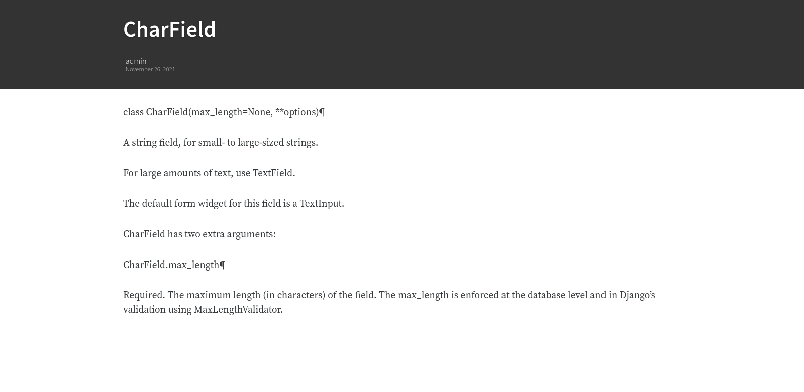

# Articles

## Article view

Next we'll implement the article view.

We'll be working with Class-Based Views: the *Django Girls* tutorial
only presents Function-Based Views, which are arguably a more intuitive
option, but CBVs are considered to be best practice, at least according
to *Two Scoops of Django*, and simplify a lot of work.

First, we create a view in `views.py`:

``` python
from django.views.generic import TemplateView, DetailView


class ArticleDetailView(DetailView):
    """detail view for individual articles"""

    model = Article
    template_name = "article_detail.html"
```

Then, we modify the `articles/urls.py` file:

``` python
from .views import Home, ArticleDetailView

urlpatterns = [
    path("", Home.as_view(), name="home"),
    path("article/<int:pk>", ArticleDetailView.as_view(), name="article_detail"),
]
```

## Article template

Now, we create the `article_detail.html` file in our `templates` folder
and add the following to it:

``` html


    <title>{{ article.title }} - Conduit: Django + HTMX</title>


    <div class="article-page">
        <div class="banner">
            <div class="container">
                <h1>{{ article.title }}</h1>
                <div class="article-meta">
                    <div class="info">
                        <span class="author">
                            {{ article.author.user.username }}
                        </span>
                        <span class="date">
                            {{ article.created_at|date:"D M d Y" }}
                        </span>
                    </div>
                </div>
            </div>
        </div>
        <div class="container page">
            <div class="row article-content">
                <div class="col-xs-12">
                    <div>
                        {{ article.body|linebreaks }}
                    </div>
                </div>
            </div>
        </div>
    </div>

```

Finally, we modify `home.html` so that article previews redirect to
articles:

``` html
...
<a href="{{ article.get_absolute_url }}" rel="prefetch" class="preview-link">   <!-- new -->
   <h1>{{ article.title }}</h1>
   <p>{{ article.description }}</p>
   <span>Read more...</span>
</a>                                                                            <!-- new -->
...
```

Let's see what it looks like:

<figure>

<figcaption aria-hidden="true">Figure 3: article_detail</figcaption>
</figure>

<figure>

<figcaption aria-hidden="true">Figure 4: article_detail - canonical
RealWorld app</figcaption>
</figure>

## Slugs

We want our article URLs to include slugs, which are easier to read than
IDs.

We want the slugs to be unique, but some articles might have the same
titles, which would generate the same slugs. One solution to this
problem is to combine slugs with UUIDs.

### Defining a slug and a UUID in the model

First, we need to modify our `Article` model to include a slug, and to
update the `get_absolute_url` method:

``` python
class Article(models.Model):
    # ...
    slug = models.SlugField(max_length=255, editable=False)             # new
    uuid_field = models.UUIDField(default=uuid.uuid4, editable=False)   # new

    # ...
    def get_absolute_url(self):
        return reverse("article_detail", kwargs={"slug": self.slug})    # new
```

After modifying the model, we need to sync the database, but this will
return a warning.

``` shell
(django) django_tutorial$ python manage.py makemigrations
You are trying to add a non-nullable field 'slug' to article without a default; we can't do that (the database needs something to populate existing rows).
Please select a fix:
 1) Provide a one-off default now (will be set on all existing rows with a null value for this column)
 2) Quit, and let me add a default in models.py
Select an option:
```

We can't select `1` because a default is by definition non-unique. We
select `2` to abort and add the `null=True` arg to the slug field, so as
to be able to migrate and then modify the slug manually through the
Django admin app:

``` python
class Article(models.Model):
    # ...
    slug = models.SlugField(max_length=100, null=True)
    # ...
```

We then run `makemigrations` and `migrate`, then set a unique slug for
each `Article` through the Django admin app manually. Once we're done,
we remove the `null=True` arg and add the `editable=False` arg:

``` python
class Article(models.Model):
    # ...
    slug = models.SlugField(max_length=255, editable=False)             # new
    # ...
```

When we migrate, we get a warning:

    (django) django_tutorial$ python manage.py makemigrations
    You are trying to change the nullable field 'slug' on article to non-nullable without a default; we can't do that (the database needs something to populate existing rows).
    Please select a fix:
     1) Provide a one-off default now (will be set on all existing rows with a null value for this column)
     2) Ignore for now, and let me handle existing rows with NULL myself (e.g. because you added a RunPython or RunSQL operation to handle NULL values in a previous data migration)
     3) Quit, and let me add a default in models.py
    Select an option:

You can safely select `2`, as we already have taken care of the slug
fields through the Django admin app.

### Generate unique slug automatically

We want to avoid manually entering the slugs for every article: the
generation of a unique slug should be triggered automatically every time
an Article is saved.

Let's create a `utils.py` file in the `conduit` folder and add the
following methods to it:

``` python
from django.utils.text import slugify
import uuid

def unique_slug_generator(instance):
    """generate a unique slug for Articles from the title and a UUID"""

    ArticleClass = instance.__class__

    # get max length of ~slug~ as defined in the Article model
    max_length = ArticleClass._meta.get_field('slug').max_length

    # create slug_uuid by concatenating slugified title and UUID
    slug = "{slug_field}-{uuid_field}".format(
        slug_field = slugify(instance.title)[:max_length-36-1],
        uuid_field = str(instance.uuid_field)
    )

    # if the slug exists, make another one
    if ArticleClass.objects.filter(slug=slug).exists():
        return unique_slug_generator(instance)

    return slug
```

### Signals

We will now use a signal, a Django utility that allows linking events
with actions, to call our `unique_slug_generator` every time an Article
is created. We could override the `Article` model's `save` method
instead: this is a common method, but not [best
practice](https://teddit.ggc-project.de/r/django/comments/p3pgr/overriding_save_vs_presave_signals_which_is/).

We create a `signals.py` file in the `articles` folder and add the
following method to it:

``` python
from django.db.models.signals import pre_save
from django.dispatch import receiver
from .models import Article
from config.utils import unique_slug_generator

@receiver(pre_save, sender=Article)
def pre_save_receiver(sender, instance, *args, **kwargs):
   if not instance.slug:
       instance.slug = unique_slug_generator(instance)
```

In order to activate this signal, we will modify `articles/apps.py`:

    from django.apps import AppConfig


    class ArticlesConfig(AppConfig):
        default_auto_field = "django.db.models.BigAutoField"
        name = "conduit.articles"

        def ready(self):                                # new
            import conduit.articles.signals             # new

Let's also change our `urlpatterns` in `articles/urls.py`:

``` python
# other imports
from .views import Home, ArticleDetailView

urlpatterns = [
    # other paths
    path("article/<slug:slug>", ArticleDetailView.as_view(), name="article_detail"),
]
```

Let's try creating an Article through the Django admin app.

When going back to <http://localhost:8000/> (where your app is running),
you will see that your new article has a slug consisting of its
slugified title and a UUID:

<figure>

<figcaption aria-hidden="true">Figure 5: article_detail -
slug</figcaption>
</figure>

### <span class="todo TODO">TODO</span> add `primary_key=True` to `uuid_field`, then add `query_pk_and_slug=True` in relevant views

