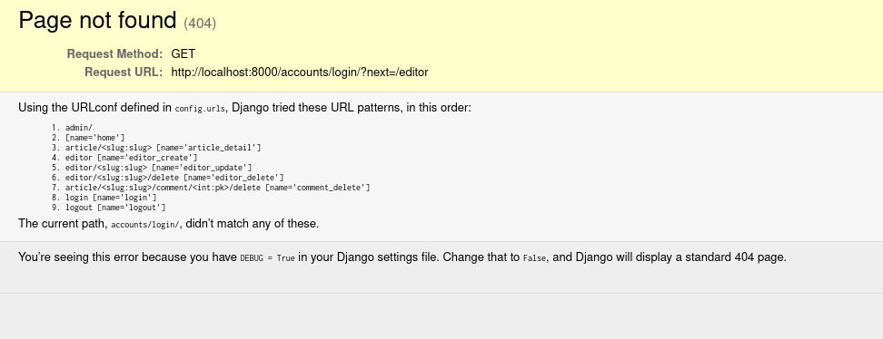

# Securing the app

## Nav

We don't want to expose the `New post` link to unauthenticated users.

In `nav.html`:

``` html
<nav class="navbar navbar-light">
  <div class="container">
    <a rel="prefetch" class="navbar-brand" href="/">conduit</a>
    <ul class="nav navbar-nav pull-xs-right">
      <li class="nav-item">
        
        <a
          href="{{ home }}"
          rel="prefetch"
          class="nav-link
                 active"
        >
          Home
        </a>
      </li>
                                <!-- new from here -->
        <li class="nav-item">
          
          <a
            href="{{ editor_create }}"
            rel="prefetch"
            class="nav-link
                   active"
          >
            <span class="ion-compose"> New Post </span>
          </a>
        </li>
        <li class="nav-item">
          <a href="" rel="prefetch" class="nav-link">
            <span class="ion-log-out"></span>
          </a>
        </li>
      
        <li class="nav-item">
          
          <a
            href="{{ login }}"
            rel="prefetch"
            class="nav-link
                   active"
          >
            Sign in
          </a>
        </li>
        <li class="nav-item">
          
          <a
            href="{{ signup }}"
            rel="prefetch"
            class="nav-link
                   active"
          >
            Sign up
          </a>
        </li>
                                                   <!-- to here -->
    </ul>
  </div>
</nav>
```

## LoginRequiredMixin

Some pages should only be accessible to authenticated users, and Django
provides an easy way of doing so through mixins. Mixins are components
that provide common extra functionality. They can be added to
class-based views on the fly.

In `articles/views.py`, add the following:

``` python
# other imports
from django.contrib.auth.mixins import LoginRequiredMixin

class EditorCreateView(LoginRequiredMixin, CreateView):
    # ...
class EditorDeleteView(LoginRequiredMixin, DeleteView):
    # ...
class CommentCreateView(LoginRequiredMixin, CreateView):
    # ...
class ArticleCommentView(LoginRequiredMixin, View):
    # ...
class CommentDeleteView(LoginRequiredMixin, DeleteView):
    # ...
```

Notice that the `LoginRequiredMixin` should be at the leftmost position
in the inheritance list: don't write
`class EditorDeleteView(DeleteView, LoginRequiredMixin)` if you want to
avoid errors.

If you try creating a post from the app, you should get this error:



The cause of the problem is given in the line:

> The current path, accounts/login/, didn't match any of these.

By default, the login url in Django is `accounts/login`: while we
changed our urls everywhere, the `LoginRequiredMixin` does not know
that. To fix this, we need to add this line in `config/settings.py`:

``` python
LOGIN_URL = "login"
```

## Only allow authors to edit or delete their articles and comments

While we're at it, let's also make sure that articles and comments can
only be edited and deleted by their authors.

In `templates/article_detail.html`, we hide the button for editing and
deleting articles from any user who is not the article's author:

``` html
                        <!-- new -->
  <span>
    <a
      href=""
      class="btn btn-outline-secondary btn-sm"
    >
      <span class="ion-edit">
        Edit Article
      </span>
    </a>
    
  </span>
                                                 <!-- new -->
```

In `templates/comment_comments.html`:

``` html

  

```

In `users/views.py`, we make sure that editing or deleting actions are
only taken into account if the user is the author of the article or
comment:

``` python
# other imports
from django.shortcuts import redirect

# ...
class EditorUpdateView(LoginRequiredMixin, UpdateView):
    # ...
    def post(self, request, *args, **kwargs):
        if request.user == self.get_object().author.user:
            return super().post(request, *args, **kwargs)
        return redirect(self.get_object().get_absolute_url())


class EditorDeleteView(LoginRequiredMixin, DeleteView):
    # ...
    def post(self, request, *args, **kwargs):
        if request.user == self.get_object().author.user:
            return super().post(request, *args, **kwargs)
        return redirect(self.get_object().get_absolute_url())


class CommentDeleteView(LoginRequiredMixin, DeleteView):
    # ...
    def post(self, request, *args, **kwargs):
        if request.user == self.get_object().author.user:
            return super().post(request, *args, **kwargs)
        return redirect(self.get_object().get_absolute_url())
```

## Testing signup and login

For now, we only have one user for our app: the `admin` superuser.

Let's create a new user by clicking on `Sign up` in our navbar. Enter a
username, an email (which doesn't have to be a real one as long as it's
the right format), and a password.

When you finalise this action by clicking the button `Sign up`, you'll
notice that you're redirected to the homepage without being logged in.
This is fine - you can sign in manually as the user you just created or
you might want to implement an email verification before allowing sign
ups - but, in our case, we might as well sign in the user automatically.

In `users/views.py`, add the following to `SignUpView` (as explained in
[this StackOverflow answer](https://stackoverflow.com/a/70582911)):

``` python
# other imports
from django.shortcuts import redirect  # new
from django.contrib.auth import authenticate, login  # new

# other views
class SignUpView(CreateView):
    model = User
    fields = ["username", "email", "password"]
    template_name = "signup.html"
    success_url = reverse_lazy("home")

    def form_valid(self, form):  # new
        # create the User object
        user = form.save(commit=False)  # new
        # set password manually
        # as otherwise the User will be saved with unhashed password
        password = form.cleaned_data.get("password")  # new
        user.set_password(password)  # new
        # save the User object to the database
        user.save()  # new
        # authenticate your user with unhashed password
        # (`authenticate` expects unhashed passwords)
        email = form.cleaned_data.get("email")  # new
        authenticated_user = authenticate(email=email, password=password)  # new
        # log in
        login(self.request, authenticated_user)  # new
        return redirect(self.success_url)  # new
```

To make sure you understand what we're doing here: Django hashes
passwords when creating a new `User`, but we need to make it explicit
that the `password` field is the password (through
`user.set_password(password)`) and needs to be hashed, otherwise there
will be errors whenever we try to authenticate:

-   Django will save the unhashed password to the database
-   during login, it will take the user-submitted plaintext password and
    hash it
-   check the hash of the user-submitted password against what it
    believes to be *the hash of the actual password* in the database
-   see that the two passwords don't match (obviously)
-   refuse authentication.

Now that we've resolved the issue, try creating a new user: everything
should work.

