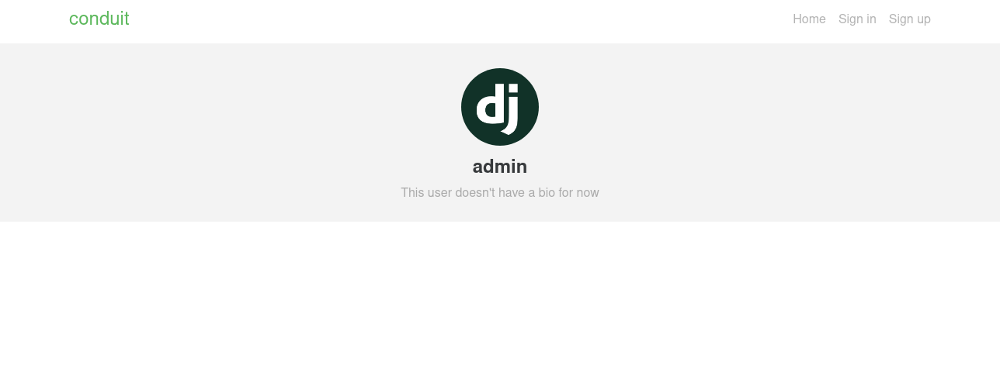
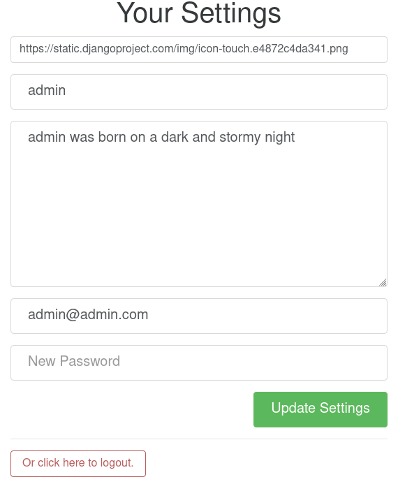

# Django tutorial Readme

## Introduction

We'll build the [Thinkster's Django RealWorld Example
App](https://github.com/gothinkster/django-realworld-example-app.git)
from the ground up, which you can see running at
<https://demo.realworld.io>. The app is called Conduit and is a Medium
clone.

    import pandas as pd
    import numpy as np
    import seaborn as sns

Instead of only building the backend in Django, we'll do both frontend
and backend, to show that SSR is still going strong.

We'll be following a simplified version of the
[cookiecutter/cookiecutter-django](https://github.com/cookiecutter/cookiecutter-django/)
architecture (made famous by the excellent book [Two Scoops of Django
3.x](https://www.feldroy.com/books/two-scoops-of-django-3-x)), but you
don't need to have read it to follow.

## Pre-requisites

-   [DjangoGirls tutorial](https://github.com/DjangoGirls/tutorial)

    You should have followed the [DjangoGirls
    tutorial](https://github.com/DjangoGirls/tutorial) before starting
    this one: it is excellent for getting you up to speed, and covers
    most of the introductory material you'll need, like HTML, CSS, and,
    of course, Django. We'll assume you have completed that tutorial and
    won't go into the specifics of anything that has already been
    covered there.

-   Python 3.9

-   Django 3.2 (or higher)

-   [conda](https://docs.conda.io/en/latest/miniconda.html) or
    [virtualenv](https://virtualenv.pypa.io/) for virtual environments

-   Optional

    -   [git](https://github.com/git-guides/install-git), to keep track
        of your work

        We assume that you know the basics of git. You should
        `git commit` at the end of every chapter.

    -   [faker](https://github.com/joke2k/faker), to avoid creating fake
        users, articles, etc. manually

## Virtual environment

Let's start this tutorial in earnest.

Before doing anything else, we need to create our virtual environment.

We're working with `conda`
([tutorial](https://docs.conda.io/en/latest/miniconda.html)), but you
can work with `virtualenv`
([tutorial](https://realpython.com/python-virtual-environments-a-primer/)).

``` shell
conda create --name django
conda activate django
conda install django
```

Now, you have a virtual environment with `django` installed.

## What we'll be doing

First, we'll decide on a project and folder structure, to keep the
project's complexity in check. We will then do the groundwork required
by Django before we can get our app running online.

We'll then dive into the tutorial proper: we'll make models,

# Creating a project

## Project layout

We'll be following the folder structure presented as best practice in
[Two Scoops of
Django](https://www.feldroy.com/books/two-scoops-of-django-3-x) by
Daniel and Audrey Feldroy, which will yield something like the
following:

    folder_name
    ├── config/
    │   ├── __init__.py
    │   ├── asgi.py
    │   ├── settings/
    │   ├── urls.py
    │   └── wsgi.py
    ├── project_name/
    │   ├── app_1/
    │   ├── app_2/
    │   ├── static/
    │   └── templates/
    ├── .gitignore
    ├── manage.py
    └── db.sqlite3

Let's create a folder for our project: we'll name it `django_tutorial`.

``` shell
(django) ~$ mkdir conduit
```

We now create our project, `conduit`:

``` shell
(django) ~$ cd conduit
(django) django_tutorial$ django-admin startproject conduit .
```

Our folder structure should look like this at this point:

    django_tutorial
    ├── conduit
    │   ├── asgi.py
    │   ├── __init__.py
    │   ├── settings.py
    │   ├── urls.py
    │   └── wsgi.py
    ├── db.sqlite3
    └── manage.py

We'll move all the files in the `conduit` folder into the
`django_tutorial/config` folder, as we explained above. The project
layout should now be:

    .
    ├── conduit
    │── config
    │   ├── asgi.py
    │   ├── __init__.py
    │   ├── settings.py
    │   ├── urls.py
    │   └── wsgi.py
    └── manage.py

Because we're deviating from Django's generic project layout, we'll have
to update some lines.

You might wonder why we have to fiddle with the settings before even
starting to code, but this small effort has the benefit of making the
structure of our project easier to understand and of separating the
config from the code, which is a good rule of thumb.

In `asgi.py` and `wsgi.py`:

``` python
os.environ.setdefault("DJANGO_SETTINGS_MODULE", "config.settings")
# from os.environ.setdefault("DJANGO_SETTINGS_MODULE", "conduit.settings")
```

In `settings.py`:

``` python
ROOT_URLCONF = "config.urls"
# from ROOT_URLCONF = "conduit.urls"

WSGI_APPLICATION = "config.wsgi.application"
# from WSGI_APPLICATION = "conduit.wsgi.application"
```

## App folder structure

Our app will have a lot of moving parts (articles, profiles, tags,
etc.). To keep the structure of our app clear, we'll host the logic for
each of these parts in separate folders.

We'll build Conduit step by step. The most basic function that the app
should have is the ability to post and read articles. Let's start with
that (you'll notice that this part is basically a repeat of Django Girls
tutorial's blog app).

``` shell
(django) django_tutorial$ cd conduit
(django) conduit$ django-admin startapp articles
(django) conduit$ cd articles
```

Our folder structure now looks like this:

``` shell
django_tutorial
├── conduit
│   ├── articles
│   │   ├── admin.py
│   │   ├── apps.py
│   │   ├── __init__.py
│   │   ├── migrations
│   │   │   └── __init__.py
│   │   ├── models.py
│   │   ├── tests.py
│   │   └── views.py
├── config
│   ├── asgi.py
│   ├── __init__.py
│   ├── settings.py
│   ├── urls.py
│   └── wsgi.py
├── db.sqlite3
└── manage.py
```

We change the `name` line in the file `apps.py` in the `articles`
folder:

``` python
from django.apps import AppConfig


class ArticlesConfig(AppConfig):
    default_auto_field = 'django.db.models.BigAutoField'
    name = 'conduit.articles'
```

We also add the line `'conduit.articles',` to INSTALLED_APPS in
`settings.py`:

``` python
INSTALLED_APPS = [
    'django.contrib.admin',
    'django.contrib.auth',
    'django.contrib.contenttypes',
    'django.contrib.sessions',
    'django.contrib.messages',
    'django.contrib.staticfiles',

    'conduit.articles', # add this line
]
```

## User model

[The Django docs warn
you](https://docs.djangoproject.com/en/3.0/topics/auth/customizing/#substituting-a-custom-user-model):
“*If you're starting a new project, it's highly recommended to set up a
custom user model, even if the default User model is sufficient for you.
\[…\] Changing AUTH_USER_MODEL after you've created database tables is
significantly more difficult \[…\]. This change can't be done
automatically and requires manually fixing your schema, moving your data
from the old user table, and possibly manually reapplying some
migrations.*”. Scary stuff. Let's just follow the advice.

First, we need to create the app where we'll do everything that has to
do with users.

``` shell
(django) conduit$ django-admin startapp users
```

We then change the `name` line in the file `apps.py` in the `articles`
folder:

``` python
from django.apps import AppConfig


class UsersConfig(AppConfig):
    default_auto_field = 'django.db.models.BigAutoField'
    name = 'conduit.users'
```

Now, in `users/models.py`, add the following:

``` python
from django.contrib.auth.models import AbstractUser
from django.db import models


class User(AbstractUser):
    """User model"""

    pass
```

What we're doing here is take the `AbstractUser` model and save it as
is. This way, we can add any modifications we need later on.

In `users/models.py` we also need to create a `Profile` model: we'll
explain it in more detail later, but suffice it to say that the
`Profile` will deal with the everything about our users that is not
authentication (logging in and out).

``` python
class Profile(models.Model):
    """Profile model"""

    user = models.OneToOneField(User)
```

Now, create a superuser in the terminal, so as to be able to access
Django's admin app later on:

``` shell
(django) django_tutorial$ python manage.py createsuperuser
```

And one last dark magic trick that you just need to do without asking
why (detailed explanations will be provided in a later section,
promise): in your terminal, in the `django_tutorial` folder, run the
following commands:

    (django) django_tutorial$ python manage.py shell

And once you're in the IPython shell:

``` python
Python 3.9.7 | packaged by conda-forge | (default, Sep 29 2021, 19:20:46)
Type 'copyright', 'credits' or 'license' for more information
IPython 7.30.1 -- An enhanced Interactive Python. Type '?' for help.

In [1]: from conduit.users.models import User, Profile

In [2]: user = User.objects.get(username='admin')

In [3]: user.profile = Profile.objects.create(user=user)
```

Finally, we need to tell Django that we're not using the default User
model. In `settings.py`, add your `users` app to `INSTALLED_APPS` and
point `AUTH_USER_MODEL` to it:

``` python
# other settings

INSTALLED_APPS = [
    # other apps
    'conduit.users'                  # new
]

AUTH_USER_MODEL = 'users.User'    # new
```

## Create a database

Make the migrations and start the server:

``` shell
(django) django_tutorial$ python manage.py makemigrations
(django) django_tutorial$ python manage.py migrate
(django) django_tutorial$ python manage.py runserver
```

Our app, Conduit, is online!

# First views and templates

## Article model

We'll start by making a model for our articles. The articles need a
title, a body (the text), a description, an author, and a creation date.

``` python
from django.db import models


class Article(models.Model):
    title = models.CharField(db_index=True, max_length=255)
    description = models.TextField(max_length=2000)
    body = models.TextField()
    author = models.ForeignKey(
        "users.Profile",
        on_delete=models.CASCADE,
        related_name="articles",
    )
    created_at = models.DateTimeField(auto_now_add=True)

    def __str__(self):
        return self.title

    def get_absolute_url(self):
        return reverse("article_detail", kwargs={"pk": self.pk})
```

The `ForeignKey` allows us to have multiple articles for every user.
`on_delete=models.CASCADE` means that the article will be deleted if the
user is deleted. `related_name="articles"` allows us to access a user's
articles through an `articles` attribute.

Let's sync the database again:

``` shell
(django) django_tutorial$ python manage.py makemigrations
(django) django_tutorial$ python manage.py migrate
```

## Django admin

In order to have something to work with for the rest of the tutorial, we
need to create some posts. Because we can't yet do it through Conduit,
we will do so through Django admin.

First, register the `Article` model in `articles/admin.py` by adding the
following line:

``` python
from django.contrib import admin
from .models import Article

admin.site.register(Article)            # new
```

The server should still be running (otherwise restart it). Log in as the
superuser you just created and create 3 articles.

## Home view

The default view that the unauthenticated user has is the global feed,
or the list of all articles.

We add the following line in `django_tutorial/conduit/urls.py`, so that
the project-level `urls.py` is aware of the urls defined in
`articles/urls.py`:

``` python
from django.contrib import admin
from django.urls import path, include

urlpatterns = [
    path('admin/', admin.site.urls),
    path('', include('conduit.articles.urls')),                         #new
]
```

Let's create a `urls.py` file in the `articles` folder, and add the
following:

``` python
from django.urls import path
from . import views

urlpatterns = [path("", Home.as_view(), name="home")]
```

In `views.py`, we add the following:

``` python
from .models import Article


class Home(TemplateView):
    """all published articles"""

    template_name = "home.html"

    def get_context_data(self, **kwargs):
        context = super().get_context_data(**kwargs)
        context["articles"] = Article.objects.order_by("-created_at")
        return context
```

## Templates folder

We need a template now, but before this we need to create a folder for
templates and for static files (icons, CSS, etc.).

It's easier to have all templates in one place, instead of in each
separate app, and the same is true for static files. Let's create the
`templates` and `static` folders:

``` shell
(django) conduit$ mkdir templates
(django) conduit$ mkdir static
```

We need to modify `settings.py` so Django is aware of our project's
architecture. Let's define the APPS_DIR below BASE_DIR first:

``` python
BASE_DIR = Path(__file__).resolve().parent.parent
APPS_DIR = BASE_DIR / "conduit"
```

Let's change the `DIRS` line in the `TEMPLATES` section in `settings.py`
like this:

``` python
"DIRS": [APPS_DIR / "templates"], # changed from "DIRS": []
```

Similarly, let's define the `STATIC_ROOT` directory below the `STATIC`
line like this:

``` python
STATIC_URL = "/static/"
STATIC_ROOT = BASE_DIR / "staticfiles"
STATICFILES_DIRS = [APPS_DIR / "static"]
```

## Base template

Let's create the base template now.

``` shell
(django) conduit$ touch templates/base.html
```

This template will contain the following:

``` html
<!doctype html>

<html lang="en">
    <head>
        <meta charset="utf-8">
        <link rel="icon" href="">
        <meta name="viewport" content="width=device-width, initial-scale=1">
        <!-- favicon -->
        <!-- Thinkster's CSS -->
        <link rel="stylesheet" href="//demo.productionready.io/main.css">
        <!-- icons for later -->
        <link href="//code.ionicframework.com/ionicons/2.0.1/css/ionicons.min.css" rel="stylesheet" type="text/css">
        <!-- fonts -->
        <link href="//fonts.googleapis.com/css?family=Titillium+Web:700|Source+Serif+Pro:400,700|Merriweather+Sans:400,700|Source+Sans+Pro:400,300,600,700,300italic,400italic,600italic,700italic&display=swap" rel="stylesheet" type="text/css">
        
            <title>Conduit: Django + HTMX</title>
        
    </head>
    <body>
        <main>
            
            
        </main>
    </body>
</html>
```

We'll also download the favicon referenced in our template: download the
file located at the URL below to
`conduit/articles/static/icons/favicon.ico`:
<https://github.com/gothinkster/react-redux-realworld-example-app/blob/master/public/favicon.ico>

## Home template

Now we'll make the `home.html` template, which for now only needs to
display our “global feed”.

Let's create the template and add the following to it:

``` html


  <div class="home-page">
    <div class="banner">
      <div class="container">
        <h1 class="logo-font">conduit</h1>
        <p>A place to share your knowledge.</p>
      </div>
    </div>
    <div class="container page">
      <div class="row">
        <div class="col-md-9">
          
            <div class="article-preview">
              No articles are here... yet.
            </div>
          
            <div>
              
                <div class="article-preview">
                  <div class="article-meta">
                    <div class="info">
                      <span class="author">
                        {{ article.author.user.username }}
                      </span>
                      <span class="date">
                        {{ article.created_at|date:"D M d Y" }}
                      </span>
                    </div>
                  </div>
                  <a href="{{ article.get_absolute_url }}" rel="prefetch" class="preview-link">
                    <h1>{{ article.title }}</h1>
                    <p>{{ article.description }}</p>
                    <span>Read more...</span>
                  </a>
                </div>
              
            </div>
          
        </div>
      </div>
    </div>
  </div>

```

The HTML is adapted from other realworld projects (especially the
[SvelteKit implementation of the RealWorld
app](https://github.com/sveltejs/realworld/), because Svelte is
unexpectedly close to Django's templating language). Because the HTML is
little more than a copy-paste, we won't explain its structure and
classes: suffice it to say that this is required to have something that
looks like the actual Realworld app.

<figure>
<figcaption aria-hidden="true">home - global feed in our app</figcaption>
</figure>

<figure>
<figcaption aria-hidden="true">home - global feed in the canonical RealWorld app</figcaption>
</figure>

It's starting to look like something, but we can improve the template a
bit.

We want to keep our templates as modular as possible, to simplify the
structure of our project and make it easier to think about. In this
case, we could move the `<div class="article-preview">` to a separate
file. Let's move all the code in the `` for
loop into the file `article_preview.html` (which we need to create).

In `templates/home.html`, we change the following lines:

``` html
<div class="container page">
  <div class="row">
    <div class="col-md-9">
        <!-- from ... -->
    </div>
  </div>
</div>
```

Our `templates/article_list.html` file should look like this:

``` html

  
    <div class="article-preview">
      No articles are here... yet.
    </div>
  
    <div>
      
         <!-- from <div class="article-preview">...</div>-->
      
    </div>
  

```

The `templates/article_preview.html` file should look like this:

``` html

  <div class="article-preview">
    <div class="article-meta">
      <div class="info">
        <span class="author">
          {{ article.author.user.username }}
        </span>
        <span class="date">
          {{ article.created_at|date:"D M d Y" }}
        </span>
      </div>
    </div>
    <a href="{{ article.get_absolute_url }}" rel="prefetch" class="preview-link">
      <h1>{{ article.title }}</h1>
      <p>{{ article.description }}</p>
      <span>Read more...</span>
    </a>
  </div>

```

You might wonder why we're adopting this template structure: it actually
comes from the Svelte implementation of the RealWorld app, and, since it
makes a lot of sense and avoids us having to reinvent the wheel, we are
taking advantage of it.

## Navbar

Let's create a simple navigation bar. Because we have yet to implement
authentication and profiles, the navbar will just contain a link to
`Home`.

Let's add the following lines to `base.html`:

``` html
<body>
                <!-- new -->
    <main>
        
        
    </main>
```

Let's create `nav.html` in our `templates` folder and add the following
to it:

``` html
<nav class="navbar navbar-light">
  <div class="container">
    <a rel="prefetch" class="navbar-brand" href="/">conduit</a>
    <ul class="nav navbar-nav pull-xs-right">
      <li class="nav-item">
        <a
          href=""
          rel="prefetch"
          class="nav-link"
        >
          Home
        </a>
      </li>
    </ul>
  </div>
</nav>
```

# Viewing articles

## Article view

Next we'll implement the article view.

We'll be working with Class-Based Views: the *Django Girls* tutorial
only presents Function-Based Views, which are arguably a more intuitive
option, but CBVs are considered to be best practice, at least according
to *Two Scoops of Django*, and simplify a lot of work.

First, we create a view in `views.py`:

``` python
from django.views.generic import TemplateView, DetailView


class ArticleDetailView(DetailView):
    """detail view for individual articles"""

    model = Article
    template_name = "article_detail.html"
```

Then, we modify the `articles/urls.py` file:

``` python
from .views import Home, ArticleDetailView

urlpatterns = [
    path("", Home.as_view(), name="home"),
    path("article/<int:pk>", ArticleDetailView.as_view(), name="article_detail"),
]
```

## Article template

Now, we create the `article_detail.html` file in our `templates` folder
and add the following to it:

``` html


    <title>{{ article.title }} - Conduit: Django + HTMX</title>


    <div class="article-page">
        <div class="banner">
            <div class="container">
                <h1>{{ article.title }}</h1>
                <div class="article-meta">
                    <div class="info">
                        <span class="author">
                            {{ article.author.user.username }}
                        </span>
                        <span class="date">
                            {{ article.created_at|date:"D M d Y" }}
                        </span>
                    </div>
                </div>
            </div>
        </div>
        <div class="container page">
            <div class="row article-content">
                <div class="col-xs-12">
                    <div>
                        {{ article.body|linebreaks }}
                    </div>
                </div>
            </div>
        </div>
    </div>

```

Finally, we modify `home.html` so that article previews redirect to
articles:

``` html
...
<a href="{{ article.get_absolute_url }}" rel="prefetch" class="preview-link">   <!-- new -->
   <h1>{{ article.title }}</h1>
   <p>{{ article.description }}</p>
   <span>Read more...</span>
</a>                                                                            <!-- new -->
...
```

Let's see what it looks like:

<figure>
<figcaption aria-hidden="true">article_detail</figcaption>
</figure>

<figure>
<figcaption aria-hidden="true">article_detail - canonical RealWorld app</figcaption>
</figure>

## Slugs

We want our article URLs to include slugs, which are easier to read than
IDs.

We want the slugs to be unique, but some articles might have the same
titles, which would generate the same slugs. One solution to this
problem is to combine slugs with UUIDs.

### Defining a slug and a UUID in the model

First, we need to modify our `Article` model to include a slug, and to
update the `get_absolute_url` method:

``` python
class Article(models.Model):
    # ...
    slug = models.SlugField(max_length=255, editable=False)             # new
    uuid_field = models.UUIDField(default=uuid.uuid4, editable=False)   # new

    # ...
    def get_absolute_url(self):
        return reverse("article_detail", kwargs={"slug": self.slug})    # new

```

After modifying the model, we need to sync the database, but this will
return a warning.

``` shell
(django) django_tutorial$ python manage.py makemigrations
You are trying to add a non-nullable field 'slug' to article without a default; we can't do that (the database needs something to populate existing rows).
Please select a fix:
 1) Provide a one-off default now (will be set on all existing rows with a null value for this column)
 2) Quit, and let me add a default in models.py
Select an option:
```

We can't select `1` because a default is by definition non-unique. We
select `2` to abort and add the `null=True` arg to the slug field, so as
to be able to migrate and then modify the slug manually through the
Django admin app:

``` python
class Article(models.Model):
    # ...
    slug = models.SlugField(max_length=100, null=True)
    # ...
```

We then run `makemigrations` and `migrate`, then set a unique slug for
each `Article` through the Django admin app manually. Once we're done,
we remove the `null=True` arg and add the `editable=False` arg:

``` python
class Article(models.Model):
    # ...
    slug = models.SlugField(max_length=255, editable=False)             # new
    # ...
```

When we migrate, we get a warning:

    (django) django_tutorial$ python manage.py makemigrations
    You are trying to change the nullable field 'slug' on article to non-nullable without a default; we can't do that (the database needs something to populate existing rows).
    Please select a fix:
     1) Provide a one-off default now (will be set on all existing rows with a null value for this column)
     2) Ignore for now, and let me handle existing rows with NULL myself (e.g. because you added a RunPython or RunSQL operation to handle NULL values in a previous data migration)
     3) Quit, and let me add a default in models.py
    Select an option:

You can safely select `2`, as we already have taken care of the slug
fields through the Django admin app.

### Generate unique slug automatically

We want to avoid manually entering the slugs for every article: the
generation of a unique slug should be triggered automatically every time
an Article is saved.

Let's create a `utils.py` file in the `conduit` folder and add the
following methods to it:

``` python
from django.utils.text import slugify
import uuid

def unique_slug_generator(instance):
    """generate a unique slug for Articles from the title and a UUID"""

    ArticleClass = instance.__class__

    # get max length of ~slug~ as defined in the Article model
    max_length = ArticleClass._meta.get_field('slug').max_length

    # create slug_uuid by concatenating slugified title and UUID
    slug = "{slug_field}-{uuid_field}".format(
        slug_field = slugify(instance.title)[:max_length-36-1],
        uuid_field = str(instance.uuid_field)
    )

    # if the slug exists, make another one
    if ArticleClass.objects.filter(slug=slug).exists():
        return unique_slug_generator(instance)

    return slug
```

### Signals

We will now use a signal, a Django utility that allows linking events
with actions, to call our `unique_slug_generator` every time an Article
is created. We could override the `Article` model's `save` method
instead: this is a common method, but not [best
practice](https://teddit.ggc-project.de/r/django/comments/p3pgr/overriding_save_vs_presave_signals_which_is/).

We create a `signals.py` file in the `articles` folder and add the
following method to it:

``` python
from django.db.models.signals import pre_save
from django.dispatch import receiver
from .models import Article
from config.utils import unique_slug_generator

@receiver(pre_save, sender=Article)
def pre_save_receiver(sender, instance, *args, **kwargs):
   if not instance.slug:
       instance.slug = unique_slug_generator(instance)
```

In order to activate this signal, we will modify `articles/apps.py`:

    from django.apps import AppConfig


    class ArticlesConfig(AppConfig):
        default_auto_field = "django.db.models.BigAutoField"
        name = "conduit.articles"

        def ready(self):                                # new
            import conduit.articles.signals             # new

Let's also change our `urlpatterns` in `articles/urls.py`:

``` python
# other imports
from .views import Home, ArticleDetailView

urlpatterns = [
    # other paths
    path("article/<slug:slug>", ArticleDetailView.as_view(), name="article_detail"),
]
```

Let's try creating an Article through the Django admin app.

When going back to <http://localhost:8000/> (where your app is running),
you will see that your new article has a slug consisting of its
slugified title and a UUID:

<figure>
<figcaption aria-hidden="true">article_detail - slug</figcaption>
</figure>

# Creating, editing, and deleting articles

We have implemented the features that allow to view articles, but we
need to allow users to create, edit, and delete them as well. We'll
first implement this functionality, and modify it later to take into
account user authentication.

## Creating Articles

Let's allow users to create articles.

We define the `EditorCreateView` view in `views.py`:

``` python
# other imports
from django.views.generic import (
     # other views
     CreateView
)

# other views

class EditorCreateView(CreateView):
    """create article"""

    model = Article
    fields = ['title', 'description', 'body']
    template_name = "editor.html"
```

We add the following to `urls.py`:

``` python
# other imports
from .views import Home, ArticleDetailView, EditorCreateView

urlpatterns = [
    # other paths
    path("editor", EditorCreateView.as_view(), name="editor_create"),
]
```

We add a `New article` button to the Nav bar in `nav.html`:

``` html
<ul class="nav navbar-nav pull-xs-right">
  <li class="nav-item">
                                        <!-- new -->
    <a
      href="{{ home }}"                                         <!-- new -->
      rel="prefetch"
      class="nav-link
             active"    <!-- new -->
    >
      Home
    </a>
  </li>
  <li class="nav-item">                                         <!-- new from here -->
    
    <a
      href="{{ editor_create }}"
      rel="prefetch"
      class="nav-link
             active"
    >
      <span class="ion-compose"> New Post </span>
    </a>
  </li>                                                         <!-- new to here -->
</ul>
```

We added `` and
`class "nav-link active"` to
better style active links.

Now, we can create the template `editor.html`:

``` html


    <title>Editor - Conduit: Django + HTMX</title>


    <div class="editor-page">
        <div class="container page">
            <div class="row">
                <div class="col-md-10 offset-md-1 col-xs-12">
                    <form method="post">
                        
                        {{ form.non_field_errors }}
                        <fieldset>
                            
                            <fieldset class="form-group">
                                <input
                                    class="form-control form-control-lg"
                                    type="text"
                                    placeholder="Article Title"
                                    name="title"
                                />
                            </fieldset>
                            {{ form.title.errors }}
                            <fieldset class="form-group">
                                <input
                                    class="form-control"
                                    type="text"
                                    placeholder="What's this article about?"
                                    name="description"
                                />
                            </fieldset>
                            {{ form.description.errors }}
                            <fieldset class="form-group">
                                <textarea
                                    class="form-control"
                                    rows="8"
                                    placeholder="Write your article (in markdown)"
                                    name='body'
                                ></textarea>
                            </fieldset>
                            {{ form.body.errors }}
                            <button class="btn btn-lg pull-xs-right btn-primary">
                                Publish Article
                            </button>
                        </fieldset>
                    </form>
                </div>
            </div>
        </div>
    </div>

```

Try to create an article in your app. When you hit “Publish”, you'll get
an error:

    IntegrityError at /editor
    NOT NULL constraint failed: articles_article.author_id

That's because the form doesn't know who the author is, and author is a
required field in our model. Let's override the `EditorCreateView`
view's `form_valid` method in our `views.py` file: before we save the
form, we'll set the logged in user (`admin`, for now) as the `author`:

``` python
class EditorCreateView(CreateView):
    """create article"""

    model = Article
    fields = ["title", "description", "body"]
    template_name = "editor.html"

    def form_valid(self, form):                         # new
        self.object = form.save(commit=False)           # new
        self.object.author = self.request.user.profile  # new
        self.object.save()                              # new
        return super().form_valid(form)                 # new
```

Once this is done, try creating another article: it should work.

## Editing Articles

We will now implement the editing feature.

In `views.py`, add the following:

``` python
# other imports
from django.views.generic import (
    # other views
    UpdateView,
)

# other views

class EditorUpdateView(UpdateView):
    """edit article"""

    model = Article
    fields = ["title", "description", "title"]
    template_name = "editor.html"
```

We're using the same template for creating and editing articles. In
`urls.py`, add:

``` python
# other imports
from .views import (
    # other views
    EditorUpdateView
)

urlpatterns = [
    # other paths
    path("editor/<slug:slug>", EditorUpdateView.as_view(), name="editor_update"),
]
```

In `article_detail.html`, we add a button for editing the article and
pass `article.slug` as an argument to the url (see [the documentation
for `url`
tag](https://docs.djangoproject.com/en/3.2/ref/templates/builtins/#url)),
given that our URL expects a slug (`editor/<slug:slug>`). The
documentation for ):

``` python
<div class="article-meta">
    <div class="info">
        <span class="author">
            {{ article.author }}
        </span>
        <span class="date">
            {{ article.created_at|date:"F d, Y" }}
        </span>
    </div>
    <span>                                                              <!-- new -->
        <a                                                              <!-- new -->
            href=""          <!-- new -->
            class="btn btn-outline-secondary btn-sm"                    <!-- new -->
        >                                                               <!-- new -->
            <span class="ion-edit">                                    <!-- new -->
                Edit Article                                            <!-- new -->
            </span>                                                    <!-- new -->
        </a>                                                            <!-- new -->
    </span>                                                             <!-- new -->
</div>
```

In the `editor.html` template, we want to have the form fields
prepopulated with the relevant values. When using `UpdateView`, we have
access to the object being updated. Let's add the following to the
`editor.html` template:

``` html
<fieldset>
    <fieldset class="form-group">
        <input
            class="form-control form-control-lg"
            type="text"
            placeholder="Article Title"
            name="title"
            value="{{ article.title|default_if_none:'' }}"          <!-- new -->
        />
    </fieldset>
    <fieldset class="form-group">
        <input
            class="form-control"
            type="text"
            placeholder="What's this article about?"
            name="description"
            value="{{ article.description|default_if_none:'' }}"    <!-- new -->
        />
    </fieldset>
    <fieldset class="form-group">
        <textarea
            class="form-control"
            rows="8"
            placeholder="Write your article (in markdown)"
            name="body"
        />{{ article.body|default_if_none:'' }}</textarea>          <!-- new -->
    </fieldset>
    <button class="btn btn-lg pull-xs-right btn-primary">
        Publish Article
    </button>
</fieldset>
```

Try editing an article: all the values should be prepopulated.

## Deleting Articles

In `views.py`, we create a `ArticleDeleteView`:

``` python
# other imports
from django.views.generic import (
    # other views
    DeleteView,
)
from django.urls import reverse_lazy

# other classes
class EditorDeleteView(DeleteView):
    """delete article"""

    model = Article
    success_url = reverse_lazy("home")
    template_name = "article_detail.html"
```

Notice that we're using the `article_detail.html` template. We could use
a separate one, but that would require to load a new page, which seems
unnecessary: we'll in a second how we're making this work.

In `urls.py`:

``` python
# other imports
from .views import (
    # other views
    EditorDeleteView,
)

urlpatterns = [
    # other paths
    path("editor/<slug:slug>/delete", EditorDeleteView.as_view(), name="editor_delete"),
]
```

Now, create an `article_delete.html` file: this will hold the form for
deleteing the article.

``` html
<form                                                                                       <!-- new  -->
    method="POST"                                                                           <!-- new  -->
    action=""                                    <!-- new  -->
    style="display:inline"                                                                  <!-- new  -->
>                                                                                           <!-- new  -->
                                                                            <!-- new  -->
    <button                                                                                 <!-- new  -->
        class="btn btn-outline-danger btn-sm"                                               <!-- new  -->
        value="DELETE"                                                                      <!-- new  -->
        onclick="return confirm('Are you sure you want to delete {{ article.title }}?')"    <!-- new  -->
    >                                                                                       <!-- new  -->
        <span class="ion-trash-a">                                                         <!-- new  -->
            Delete Article                                                                  <!-- new  -->
        </span>                                                                                <!-- new  -->
    </button>                                                                               <!-- new  -->
</form>                                                                                     <!-- new  -->
```

Now, we want to load this template in `article_detail.html` directly,
which we achieve with an `include` tag:

``` html
<span>
    <a
        href=""
        class="btn btn-outline-secondary btn-sm"
    >
        <i class="ion-edit">
            Edit Article
        </i>
    </a>
                 <!-- new -->
</span>
```

Try deleting an article: you should get a nice confirmation message
while still on the `article_detail.html` template, before the article is
deleted.

# Comments

Now that we have articles, we need comments.

## Model

A comment needs a related article, an author, a body, and a date. Let's
create a `Comment` model in `models.py`:

``` python
# other models

class Comment(models.Model):
    article = models.ForeignKey(
        Article,
        on_delete=models.CASCADE,
        related_name="comments",
        to_field="slug",
    )
    body = models.TextField()
    author = models.ForeignKey(
        settings.AUTH_USER_MODEL,
        on_delete=models.CASCADE,
        related_name="comments",
    )
    created_at = models.DateTimeField(auto_now_add=True)

    def __str__(self):
        return self.body[:60] + "..."

    def get_absolute_url(self):
        return reverse("article_detail", kwargs={"slug": self.article.slug})
```

Let's `makemigrations` and `migrate`. You should get the following
error:

    SystemCheckError: System check identified some issues:

    ERRORS:
    articles.Comment.article: (fields.E311) 'Article.slug' must be unique because it is referenced by a foreign key.
            HINT: Add unique=True to this field or add a UniqueConstraint (without condition) in the model Meta.constraints.

That's because we're using articles' slugs as ForeignKeys for the
comments (so that we can filter our comments by the attached articles'
slugs instead of their UUIDs). This error is easily corrected by adding
`unique=True` as an argument to the `slug` field in the `Article` model
in `models.py`. You should be able to `makemigrations` and `migrate`
after that.

Now, we need to register our model in `admin.py`:

``` python
from django.contrib import admin
from .models import Article, Comment        # new

admin.site.register(Article)
admin.site.register(Comment)                # new
```

When this is done, go to your admin app and create a few comments for a
couple articles.

## Viewing comments

We want to be able to view the comments in our `article_detail.html`
template.

In `article_detail.html`:

``` html
<div class="container page">
    <div class="row article-content">
        <div class="col-xs-12">
            <div>
                {{ article.body|linebreaks }}
            </div>
        </div>
    </div>
    <hr />                                  <!-- new -->
    <div class="row">                       <!-- new -->
               <!-- new -->
    </div>                                  <!-- new -->
</div>
```

Now create `comments.html` in the `templates` folder and add the
following:

``` html
<div class="col-xs-12 col-md-8 offset-md-2">
    
        <div class="card">
            <div class="card-block">
                <p class="card-text">
                    {{ comment.body }}
                </p>
            </div>
            <div class="card-footer">
                <span class="comment-author">
                    {{ comment.author.user.username }}
                </span>
                <span class="date-posted">
                    {{ comment.created_at|date:"D M d Y" }}
                </span>
            </div>
        </div>
    
</div>
```

## Creating comments

We will now start allowing our users to leave comments on the website.
We could do this like in the Django Girls tutorial: the
`ArticleDetailView` would include a button that would direct to
`CommentCreateView` on a separate page, and saving the comment would
bring the user back to the `ArticleDetailView`. However, the
`RealWorldApp` allows users to create and save their comments directly
below the article, on the same page, so that's what we're going to try.

Surprisingly, this is not straightforward to implement in Django,
because it implies mixing `DetailView` and `CreateView` functionalities
in a single page, which is made difficult by the fact that the
`DetailView` doesn't have a POST method, while the `CreateView` requires
it. Fortunately, our use case is covered in the Django documentation:
<https://docs.djangoproject.com/en/4.0/topics/class-based-views/mixins/#an-alternative-better-solution>.

First, we'll create a `CommentCreateView` in `users/views.py`. We
override the `form_valid` method because we need to specify the `author`
and `article` fields required by the `Comment` model. We also override
the `get_success_url` because we want the user to be redirected to the
`ArticleDetailView` upon saving the comment.

``` python
# other imports
from .models import Article, Comment

# other models
class CommentCreateView(CreateView):
    """create comment"""

    model = Comment
    fields = ["body"]
    template_name = "article_detail.html"

    def form_valid(self, form):
        form.instance.author = self.request.user.profile
        form.instance.article = Article.objects.filter(
            slug=self.kwargs.get("slug")
        ).first()
        return super().form_valid(form)

    def get_success_url(self):
        return reverse("article_detail", kwargs={"slug": self.object.article.slug})
```

Now, we need to modify the `ArticleDetailView` to make the
`CommentCreateView`'s form available to `templates/article_detail.html`
through the `get_context_data` method:

``` python
class ArticleDetailView(DetailView):
    """detail view for individual articles"""

    model = Article
    template_name = "article_detail.html"

    def get_context_data(self, **kwargs):                   # new
        context = super().get_context_data(**kwargs)        # new
        context["form"] = CommentCreateView().get_form()    # new
        return context                                      # new
```

Finally, we create a view that combines `ArticleDetailView` and
`CommentCreateView`:

``` python
# other imports
from django.views.generic import (
    # other views
    View,
)


# other models
class ArticleCommentView(View):
    """view article and post comments"""

    def get(self, request, *args, **kwargs):
        view = ArticleDetailView.as_view()
        return view(request, *args, **kwargs)

    def post(self, request, *args, **kwargs):
        view = CommentCreateView.as_view()
        return view(request, *args, **kwargs)
```

We want this new hybrid view to be the one returned by the
`article/<slug:slug>` path: depending on whether the method is `GET` or
`POST`, the new view will either return the `ArticleDetailView`, or the
`CommentCreateView`.

In `urls.py`, we replace the `article_detail` path by the following:

``` python
# other imports
from .views import (
    # other views
    ArticleCommentView,
)

urlpatterns = [
    # other paths
    path(
        "article/<slug:slug>",
        ArticleCommentView.as_view(),
        name="article_detail",
    ),
    # instead of =path("article/<slug:slug>", ArticleCommentView.as_view(), name="article_detail")=
]
```

Now that our views.py and urls.py are ready, we need to create the
templates.

Create `comment_create.html`, which corresponds to the
`CommentCreateView`'s form:

``` html

    <form
        class="card comment-form"
        method="post"
        action=""
    >
        
        <div class="card-block">
            <textarea
                class="form-control"
                rows="3"
                placeholder="Write a comment..."
                name="{{ form.body.name }}"
            >{{ form.body.value|default_if_none:'' }}</textarea>
        </div>
        <div class="card-footer">
            <button class="btn btn-sm btn-primary" type="submit">
                Post Comment
            </button>
        </div>
    </form>

```

In `comments.html`, we include the `comment_create.html` template:

``` html
<div class="col-xs-12 col-md-8 offset-md-2">
    <div>                                           <!-- new -->
                 <!-- new -->
    </div>                                          <!-- new -->
    
    <!-- ... -->
```

Everything should be working now. Try to create some comments on an
article.

## Deleting comments

We now want to be able to delete comments.

In `articles/views.py`, add the `CommentDeleteView`:

``` python
class CommentDeleteView(DeleteView):
    """delete comment"""

    model = Comment
    template_name = "article_detail.html"

    # redirect to attached article's detail page upon success
    def get_success_url(self):
        return reverse("article_detail", kwargs={"slug": self.object.article.slug})
```

In `urls.py`:

``` python
urlpatterns = [
    # ...
    path(
        "article/<slug:slug>/comment/<int:pk>/delete",
        CommentDeleteView.as_view(),
        name="comment_delete",
    ),
]
```

We require `pk` as an argument because that's what the
`CommentDeleteView` needs to know which comment to delete. The
`<slug:slug>` part is unnecessary, but it makes the path more logical, I
find.

In `comments.html`:

``` html
<div class="card-footer">
    <span class="comment-author">
        {{ comment.author }}
    </span>
    <span class="date-posted">
        {{ comment.created_at|date:"D M d Y" }}
    </span>
                 <!-- new -->
</div>
```

Create `comment_delete.html`:

``` html

    <form
        method="post"
        action=""
        class="mod-options"
    >
        
        <button
            style="background: none;
                   border: none;
                   padding: 0;
                   margin: 0;
                   font-size: inherit;
                   margin-left: 5px;
                   opacity: 0.6;
                   cursor: pointer;"
            value="DELETE"
            class="ion-trash-a"
        ></button>
    </form>

```

# Users and Profiles

## Introduction

Time to work on our users and profiles.

[The Django docs
say](https://docs.djangoproject.com/en/4.0/topics/auth/customizing/#specifying-a-custom-user-model)
“*it may be more suitable to store app-specific user information in a
model that has a relation with your custom user model. That allows each
app to specify its own user data requirements without potentially
conflicting or breaking assumptions by other apps. It also means that
you would keep your user model as simple as possible, focused on
authentication, and following the minimum requirements Django expects
custom user models to meet.*”.

This is why we'll have the authentication logic in a `User` model and
the profile logic in a `Profile` model.

## User model

### User

The `User` model will contain everything related to authentication.

We need an email, a username, and a password. Let's add the following to
the `User` model in `users/models.py`:

``` python
from django.contrib.auth.models import AbstractUser
from django.db import models


class User(AbstractUser):
    """User model"""

    username = models.CharField(max_length=255, unique=True)
    email = models.EmailField(unique=True)

    USERNAME_FIELD = "email"
    REQUIRED_FIELDS = ["username"]

    def __str__(self):
        self.email
```

The `username` field is the unique human-readable identifier that we can
represent users with in our app. The `email` field holds the email users
will be logging in with. We specify this in `USERNAME_FIELD`. The
`password` field is already provided by `AbstractUser`.
`REQUIRED_FIELDS` is the list of field users will be prompted for at
sign up: because the `USERNAME_FIELD` and the `password` are already
required by Django, we only need to specify `username`. More information
about the fields can be found in the docs for [the default Django User
model](https://docs.djangoproject.com/en/4.0/ref/contrib/auth/).

### UserManager

We also need a `UserManager`, [as advised by the
docs](https://docs.djangoproject.com/en/4.0/topics/auth/customizing/#writing-a-manager-for-a-custom-user-model).
In `models.py`, we add the following, BEFORE we define our `User` model:

``` python
# other imports
from django.contrib.auth.models import AbstractUser, UserManager

# other models
class CustomUserManager(UserManager):
    """custom UserManager with unique identifier is email instead of username"""

    def create_user(self, username, email, password=None):
        """Create and return a User with username, email, and password"""

        if email is None:
            raise ValueError("Email is required.")
        if username is None:
            raise ValueError("Username is required")

        email = self.normalize_email(email)
        user = self.model(username=username, email=email)
        user.set_password(password)
        user.save()

        return user

    def create_superuser(self, username, email, password=None):
        """Create and return a SuperUser with admin permissions."""

        user = self.create_user(username, email, password)
        user.is_staff = True
        user.is_superuser = True
        user.is_active = True
        user.save()

        return user
```

`create_user` and `create_superuser` are self-explanatory.

We now need to go back to the `User` model in `users/models.py` and
indicate to Django that the `UserManager` defined above will manage
objects of type `User`:

``` python
# other
class User(AbstractUser):
    """User model"""

    username = models.CharField(max_length=255, unique=True)
    email = models.EmailField(unique=True)

    USERNAME_FIELD = "email"
    REQUIRED_FIELDS = ["username"]

    objects = CustomUserManager()               # new

    def __str__(self):
        return self.email
```

Make sure to `makemigrations` and `migrate`, so that Django is aware of
your new model.

### admin.py

We need to register this new `User` model in `users/admins.py`, to have
access to it in our admin app.

``` python
from django.contrib import admin
from .models import User

admin.site.register(User)
```

## Profile model

### Profile

We are following the instructions in the Django docs about [extending a
User
model](https://docs.djangoproject.com/en/4.0/topics/auth/customizing/#extending-the-existing-user-model).
We need to store some information about our users in the database. Each
`User` object should be related to a single `Profile`, and vice-versa:
we'll use a
[`OneToOneField`](https://docs.djangoproject.com/en/4.0/ref/models/fields/#onetoonefield)
relationship.

Our `Profile` needs the following fields:

-   image
-   bio
-   articles
-   comments

We have already taken care of the two last fields in the `Article` and
`Comment` models through the `ForeignKey` relationships.

We will allow users to specify a URL to their avatar and to write a
short bio. This is optional, so we make sure to have `blank=True`. Let's
add the following to the `Profile` model in `users/models.py`:

``` python
class Profile(models.Model):
    """Profile model"""

    user = models.OneToOneField(settings.AUTH_USER_MODEL, on_delete=models.CASCADE)
    image = models.URLField(
        default="https://static.productionready.io/images/smiley-cyrus.jpg"
    )
    bio = models.TextField(max_length=1000, blank=True)

    def __str__(self):
        return self.user.username
```

As always, whenever you change a model, you should `makemigrations` and
`migrate`.

### signals.py

Since we're defining the `Profile` outside of the `User` model, a
profile won't be created automatically whenever a user signs up.

Let's follow the docs linked above and code up a signal that creates a
`Profile` at user sign-up.

Create a `signals.py` file in the `users` folder and add the following:

``` python
from django.db.models.signals import post_save
from django.dispatch import receiver
from .models import User, Profile


@receiver(post_save, sender=User)
def create_profile_for_user(sender, instance, created, **kwargs):
    if created:
        Profile.objects.create(user=instance)


@receiver(post_save, sender=User)
def save_profile_for_user(sender, instance, **kwargs):
    instance.profile.save()
```

In order to activate this signal, we will modify `users/apps.py`:

``` python
from django.apps import AppConfig


class UsersConfig(AppConfig):
    default_auto_field = "django.db.models.BigAutoField"
    name = "conduit.users"

    def ready(self):                        # new
        import conduit.users.signals        # new
```

This signal runs whenever a `User` is saved. By checking for `created`,
we make sure to only initiate a `Profile` for the `User` instance if the
User has just been created, instead of whenever the instance is updated.

### admin.py

We need to register this new `Profile` model in `users/admins.py`, to
have access to it in our admin app, but we want to be able to view
`User` and `Profile` information for a given user in the same place.

``` python
from django.contrib import admin
from .models import User, Profile


class ProfileInline(admin.StackedInline):
    model = Profile
    can_delete = False


class UserAdmin(admin.ModelAdmin):
    model = User
    inlines = [ProfileInline]


admin.site.register(User, UserAdmin)
```

You'll notice that this code is much shorter than [what the docs
say](https://docs.djangoproject.com/en/4.0/topics/auth/customizing/#extending-the-existing-user-model):
we're trying to keep it simple, so we'll do without some of the quality
of life improvements that a more intricate code would allow.

# Authentication

## Auth views

In `users/views.py`, we take advantage of the generic `LoginView`,
`LogoutView`, and `CreateView` to implement our authentication logic:

``` python
from django.contrib.auth.views import LoginView, LogoutView
from django.views.generic import CreateView
from django.urls import reverse_lazy
from .models import User


class Login(LoginView):
    template_name = "login.html"
    next_page = reverse_lazy("home")

    def get(self, request, *args, **kwargs):
        if request.user.is_authenticated:
            return redirect(self.next_page)
        return super().get(request, *args, **kwargs)


class Logout(LogoutView):
    next_page = reverse_lazy("home")


class SignUpView(CreateView):
    model = User
    fields = ["username", "email", "password"]
    template_name = "signup.html"
    success_url = reverse_lazy("home")

    def get(self, request, *args, **kwargs):
        if request.user.is_authenticated:
            return redirect(self.success_url)
        return super().get(request, *args, **kwargs)
```

We don't have to specify much to the generic views, they're quite
full-featured as is. What we did here is indicate where the templates
live and where the views redirect to (the
[defaults](https://docs.djangoproject.com/en/dev/ref/settings/#login-redirect-url)
are `accounts/profile` for `LoginView` and `None` for `LogoutView`). We
also overrode the `get` method in `LoginView` and `SignUpView`, so that
already authenticated users who for some reason visit the login page are
automatically redirected to the `home` URL. We didn't specify a template
for `LogoutView` because it's not necessary.

## Auth urls

Let's deal with the URL patterns now. Create `users/urls.py` and add the
following:

``` python
from django.urls import path
from .views import Login, Logout, SignUp


urlpatterns = [
    path("login", Login.as_view(), name="login"),
    path("logout", Logout.as_view(), name="logout"),
    path("signup", SignUp.as_view(), name="signup"),
]
```

For every app that we create, we need to tell `config/urls.py` to look
at the patterns specified in the app's `urls.py` file:

``` python
urlpatterns = [
    path("admin/", admin.site.urls),
    path("", include("conduit.articles.urls")),
    path("", include("conduit.users.urls")),        # new
]
```

## Auth templates

### login.html

Let's create `login.html` in the `templates` folder:

``` html


    <title>Sign in - Conduit: Django + HTMX</title>


    <div class="auth-page">
        <div class="container page">
            <div class="row">
                <div class="col-md-6 offset-md-3 col-xs-12">
                    <h1 class="text-xs-center">Sign In</h1>
                    <p class="text-xs-center">
                        <a href="">Need an account?</a>
                    </p>
                    {{ form.non_field_errors }}
                    <form method="post">
                        
                        <fieldset class="form-group">
                            <input
                                class="form-control form-control-lg"
                                type="email"
                                placeholder="Email"
                                name="{{ form.username.name }}"
                            >
                            {{ form.username.errors }}
                        </fieldset>
                        <fieldset class="form-group">
                            <input
                                class="form-control form-control-lg"
                                type="password"
                                placeholder="Password"
                                name="{{ form.password.name }}"
                            >
                            {{ form.password.errors }}
                        </fieldset>
                        <button class="btn btn-lg btn-primary pull-xs-right" type="submit">
                            Sign in
                        </button>
                    </form>
                </div>
            </div>
        </div>
    </div>

```

Notice that we are using `form.username` to authenticate. I initially
was trying to work with `form.email`, because that was the field we
chose to authenticate with, but it kept throwing errors: Django didn't
see the field, didn't POST the value that I gave it, and asked for the
username every time. It took me a while, but I realised that our
username *is* the email. `form.username` is effectively querying what
the `USERNAME_FIELD` is. Not straightforward though.

### signup.html

Create `signup.html`:

``` html


    <title>Sign up - Conduit: Django + HTMX</title>


    <div class="auth-page">
        <div class="container page">
            <div class="row">
                <div class="col-md-6 offset-md-3 col-xs-12">
                    <h1 class="text-xs-center">Sign up</h1>
                    <p class="text-xs-center">
                        <a href="">Have an account?</a>
                    </p>
                    {{ form.non_field_errors }}
                    <form method="post">
                        
                        <fieldset class="form-group">
                            <input
                                class="form-control form-control-lg"
                                type="text"
                                placeholder="Your {{ form.username.name }}"
                                name="{{ form.username.name }}"
                                value="{{ form.username.value|default_if_none:'' }}"
                            >
                        </fieldset>
                        {{ form.username.errors }}
                        <fieldset class="form-group">
                            <input
                                class="form-control form-control-lg"
                                type="email"
                                placeholder="Your {{ form.email.name }}"
                                name="{{ form.email.name }}"
                                value="{{ form.email.value|default_if_none:''  }}"
                            >
                        </fieldset>
                        {{ form.email.errors }}
                        <fieldset class="form-group">
                            <input
                                class="form-control form-control-lg"
                                type="password"
                                placeholder="Your {{ form.password.name }}"
                                name="{{ form.password.name }}"
                            >
                        </fieldset>
                        {{ form.password.errors }}
                        <button class="btn btn-lg btn-primary pull-xs-right">
                            Sign up
                        </button>
                    </form>
                </div>
            </div>
        </div>
    </div>

```

# Securing the app

## Nav

We don't want to expose the `New post` link to unauthenticated users.

In `nav.html`:

``` html
<nav class="navbar navbar-light">
  <div class="container">
    <a rel="prefetch" class="navbar-brand" href="/">conduit</a>
    <ul class="nav navbar-nav pull-xs-right">
      <li class="nav-item">
        
        <a
          href="{{ home }}"
          rel="prefetch"
          class="nav-link
                 active"
        >
          Home
        </a>
      </li>
                                <!-- new from here -->
        <li class="nav-item">
          
          <a
            href="{{ editor_create }}"
            rel="prefetch"
            class="nav-link
                   active"
          >
            <span class="ion-compose"> New Post </span>
          </a>
        </li>
        <li class="nav-item">
          <a href="" rel="prefetch" class="nav-link">
            <span class="ion-log-out"></span>
          </a>
        </li>
      
        <li class="nav-item">
          
          <a
            href="{{ login }}"
            rel="prefetch"
            class="nav-link
                   active"
          >
            Sign in
          </a>
        </li>
        <li class="nav-item">
          
          <a
            href="{{ signup }}"
            rel="prefetch"
            class="nav-link
                   active"
          >
            Sign up
          </a>
        </li>
                                                   <!-- to here -->
    </ul>
  </div>
</nav>
```

## LoginRequiredMixin

Some pages should only be accessible to authenticated users, and Django
provides an easy way of doing so through mixins. Mixins are components
that provide common extra functionality. They can be added to
class-based views on the fly.

In `articles/views.py`, add the following:

``` python
# other imports
from django.contrib.auth.mixins import LoginRequiredMixin

class EditorCreateView(LoginRequiredMixin, CreateView):
    # ...
class EditorDeleteView(LoginRequiredMixin, DeleteView):
    # ...
class CommentCreateView(LoginRequiredMixin, CreateView):
    # ...
class ArticleCommentView(LoginRequiredMixin, View):
    # ...
class CommentDeleteView(LoginRequiredMixin, DeleteView):
    # ...
```

Notice that the `LoginRequiredMixin` should be at the leftmost position
in the inheritance list: don't write
`class EditorDeleteView(DeleteView, LoginRequiredMixin)` if you want to
avoid errors.

If you try creating a post from the app, you should get this error:


The cause of the problem is given in the line:

> The current path, accounts/login/, didn't match any of these.

By default, the login url in Django is `accounts/login`: while we
changed our urls everywhere, the `LoginRequiredMixin` does not know
that. To fix this, we need to add this line in `config/settings.py`:

``` python
LOGIN_URL = "login"
```

## Only allow authors to edit or delete their articles and comments

While we're at it, let's also make sure that articles and comments can
only be edited and deleted by their authors.

In `templates/article_detail.html`, we hide the button for editing and
deleting articles from any user who is not the article's author:

``` html
                        <!-- new -->
  <span>
    <a
      href=""
      class="btn btn-outline-secondary btn-sm"
    >
      <span class="ion-edit">
        Edit Article
      </span>
    </a>
    
  </span>
                                                 <!-- new -->
```

In `templates/comment_comments.html`:

``` html

  

```

In `users/views.py`, we make sure that editing or deleting actions are
only taken into account if the user is the author of the article or
comment:

``` python
# other imports
from django.shortcuts import redirect

# ...
class EditorUpdateView(LoginRequiredMixin, UpdateView):
    # ...
    def post(self, request, *args, **kwargs):
        if request.user == self.get_object().author.user:
            return super().post(request, *args, **kwargs)
        return redirect(self.get_object().get_absolute_url())


class EditorDeleteView(LoginRequiredMixin, DeleteView):
    # ...
    def post(self, request, *args, **kwargs):
        if request.user == self.get_object().author.user:
            return super().post(request, *args, **kwargs)
        return redirect(self.get_object().get_absolute_url())


class CommentDeleteView(LoginRequiredMixin, DeleteView):
    # ...
    def post(self, request, *args, **kwargs):
        if request.user == self.get_object().author.user:
            return super().post(request, *args, **kwargs)
        return redirect(self.get_object().get_absolute_url())
```

## Testing signup and login

For now, we only have one user for our app: the `admin` superuser.

Let's create a new user by clicking on `Sign up` in our navbar. Enter a
username, an email (which doesn't have to be a real one as long as it's
the right format), and a password.

When you finalise this action by clicking the button `Sign up`, you'll
notice that you're redirected to the homepage without being logged in.
This is fine - you can sign in manually as the user you just created or
you might want to implement an email verification before allowing sign
ups - but, in our case, we might as well sign in the user automatically.

In `users/views.py`, add the following to `SignUpView` (as explained in
[this StackOverflow answer](https://stackoverflow.com/a/70582911)):

``` python
# other imports
from django.shortcuts import redirect  # new
from django.contrib.auth import authenticate, login  # new

# other views
class SignUpView(CreateView):
    model = User
    fields = ["username", "email", "password"]
    template_name = "signup.html"
    success_url = reverse_lazy("home")

    def form_valid(self, form):  # new
        # create the User object
        user = form.save(commit=False)  # new
        # set password manually
        # as otherwise the User will be saved with unhashed password
        password = form.cleaned_data.get("password")  # new
        user.set_password(password)  # new
        # save the User object to the database
        user.save()  # new
        # authenticate your user with unhashed password
        # (`authenticate` expects unhashed passwords)
        email = form.cleaned_data.get("email")  # new
        authenticated_user = authenticate(email=email, password=password)  # new
        # log in
        login(self.request, authenticated_user)  # new
        return redirect(self.success_url)  # new
```

To make sure you understand what we're doing here: Django hashes
passwords when creating a new `User`, but we need to make it explicit
that the `password` field is the password (through
`user.set_password(password)`) and needs to be hashed, otherwise there
will be errors whenever we try to authenticate:

-   Django will save the unhashed password to the database
-   during login, it will take the user-submitted plaintext password and
    hash it
-   check the hash of the user-submitted password against what it
    believes to be *the hash of the actual password* in the database
-   see that the two passwords don't match (obviously)
-   refuse authentication.

Now that we've resolved the issue, try creating a new user: everything
should work.

# Profile features

## Viewing Profiles

It's time to allow users to view their own and other users' profiles.

In `users/views.py`:

``` python
# other imports
from django.views.generic import CreateView, DetailView

# other views
class ProfileDetailView(DetailView):
    model = User
    template_name = "profile_detail.html"
```

In `users/urls.py`:

``` python
# other imports
from .views import Login, Logout, SignUpView, ProfileDetailView


urlpatterns = [
    # other paths
    path("profile/@<str:username>", ProfileDetailView.as_view(), name="profile_detail"),
]
```

In the `templates` folder, create `profile_detail.html`:

``` html


    <title>{{ profile.user.username }} - Conduit: Django + HTMX</title>


    <div class="profile-page">
        <div class="user-info">
            <div class="container">
                <div class="row">
                    <div class="col-xs-12 col-md-10 offset-md-1">
                        
                        <h4>{{ profile.user.username }}</h4>
                        <p>{{ profile.bio|default:"This user doesn't have a bio for now" }}</p>
                    </div>
                </div>
            </div>
        </div>
    </div>

```

Everything should be working now, right? Let's check by going to
`localhost:8000/profile/@admin`, for example. Welp, we're getting an
error:

<figure>
<figcaption aria-hidden="true">profile_detail - error</figcaption>
</figure>

The error tells us that our `ProfileDetailView` wants to be called with
an object primary key or a slug, while we're calling it with a
`username`. The solution is simple: we just change how the view decides
which objects to show.

We override the view's `get_object` method by adding the following to
`users/views.py`:

``` python
# other imports
from django.shortcuts import redirect, get_object_or_404

# other views
class ProfileDetailView(DetailView):
    model = Profile
    template_name = "profile_detail.html"

    def get_object(self, queryset=None):
        username = self.kwargs.get("username", None)
        profile = get_object_or_404(User, username=username).profile
        return profile
```

Let's try again: we should see an actual profile page (though there
isn't much on it yet). Make sure to set a profile image for your `admin`
user, as everyone else should have a default already set.

<figure>
<figcaption aria-hidden="true">profile_detail</figcaption>
</figure>

## Viewing Articles written by each User

Whenever we visit a user's profile, we want to see all the articles
written by that specific user. We could make a `ListView`, but passing
the list to our `DetailView`'s context is simpler.

In `users/views.py`, override the `get_context_data` method of
`ProfileDetailView`:

``` python
# other views
class ProfileDetailView(DetailView):
    # ...

    def get_context_data(self, **kwargs):
        context = super().get_context_data(**kwargs)
        if self.request.user.is_authenticated:
            context["my_articles"] = self.object.articles.order_by('-created_at')
        return context
```

This will return all the articles written by the user whose username is
specified in the URL: for example, `/profile/@admin` will return all the
articles written by `admin`. Technically, we could have obtained this
queryset directly in the template with something like
`{{ profile.articles.order_by|dictsortreversed:"created_at" }}`, but
dealing with logic in views makes for clearer code and easier debugging.

Expose the `article_list.html` template in
`templates/profile_detail.html`:

``` html


    <title>{{ profile.user.username }} - Conduit: Django + HTMX</title>


    <div class="profile-page">
        <div class="user-info">
            <div class="container">
                <div class="row">
                    <div class="col-xs-12 col-md-10 offset-md-1">
                        
                        <h4>{{ profile.user.username }}</h4>
                        <p>{{ profile.bio|default:"This user doesn't have a bio for now" }}</p>
                    </div>
                </div>
            </div>
        </div>
        <div class="container">                 <!-- new from here -->
            <div class="row">
                <div class="col-xs-12 col-md-10 offset-md-1">
                    <div class="articles-toggle">
                        <ul class="nav nav-pills outline-active">
                            <li class="nav-item">
                                <span class="nav-link">
                                  My Articles
                                </span>
                            </li>
                        </ul>
                    </div>
                    
                </div>
            </div>
        </div>                                  <!-- new to here -->
    </div>

```

## Links to Profiles in templates

We now need to link the profile page from all the places our users'
usernames are exposed.

In `templates/article_preview.html`, change the following lines:

``` html
<div class="article-meta">
  <a href="">                    <!-- new -->
               <!-- new -->
  </a>                                                                                           <!-- new -->
  <div class="info">
    <a href="" class="author"> <!-- from <span class="author"> -->
        {{ article.author.user.username }}
    </a>                                                                                       <!-- from </span> -->
    <span class="date">
      {{ article.created_at|date:"D M d Y" }}
    </span>
  </div>
</div>
```

In `templates/nav.html`:

``` html

  <li class="nav-item">
    
    <a
      href="{{ editor_create }}"
      rel="prefetch"
      class="nav-link
             active"
    >
      <span class="ion-compose"> New Post </span>
    </a>
  </li>
  <li class="nav-item">                             <!-- new from here -->
    
    <a
      href="{{ profile }}"
      rel="prefetch"
      class="nav-link
             active"
    >
      
      {{ user.username }}
    </a>
  </li>                                             <!-- new to here -->
  <li class="nav-item">
    <a rel="prefetch" href="" class="nav-link">
      <span class="ion-log-out"></span>
    </a>
  </li>

```

In `templates/article_detail.html`:

``` html
<div class="article-meta">
  <a href="">                  <!-- new -->
               <!-- new -->
  </a>                                                                                         <!-- new -->
  <div class="info">
    <a href="" class="author"> <!-- from <span class="author"> -->
      {{ article.author.user.username }}
    </a>                                                                                       <!-- from </span> -->
    <span class="date">
      {{ article.created_at|date:"D M d Y" }}
    </span>
  </div>
```

In `templates/comments.html`:

``` html
<div class="card-footer">
  <a href="" class="comment-author">            <!-- new -->
     <!-- new -->
  </a>                                                                                                          <!-- new -->
  <a href="" class="comment-author"> <!-- from <span class="comment-author"> -->
      {{ comment.author.user.username }}
  </a>                                                                                               <!-- from </span>-->
  <span class="date-posted">
    {{ comment.created_at|date:"D M d Y" }}
  </span>
  
</div>
```

# Editing profiles

## Introduction

We want to allow users to modify their profile information (image, bio)
and user information (username, email, password) at the same place. That
is, we want to allow users to update 2 models at the same URL.
Surprisingly, this common use case is not straightforward to implement
with Django, especially if we're trying to follow good practice and use
class-based views. Take a break before continuing, as we're going to go
into the weeds here.

Cool, let's recap what we're doing. We have two models (`User` and
`Profile`), which happen to be related with a `OneToOneField`. We want
to update these models in one place. Intuitively, we'll reach for the
`UpdateView`. The problem is that `UpdateView` expects a single model.
The solution is to tell our `UpdateView` to deal with two forms.

## Forms

Let's create `users/forms.py` and define two forms, one for each model:

``` python
from django import forms
from .models import Profile, User


class ProfileForm(forms.ModelForm):
    class Meta:
        model = Profile
        fields = ["image", "bio"]


class UserForm(forms.ModelForm):
    new_password = forms.CharField(required=False)

    class Meta:
        model = User
        fields = ["username", "email", "new_password"]

    def save(self, commit=True):
        user = super().save(commit=False)
        new_password = self.cleaned_data.get("new_password")
        if new_password:
            user.set_password(new_password)
        user.save()
        return user
```

[`ModelForm`](https://docs.djangoproject.com/en/4.0/topics/forms/modelforms/)
allows to get a lot of model-relevant form logic for free (Django's
“batteries included” philosophy).

The `ProfileForm` is self-explanatory.

The `UserForm` is a bit more complicated. Let's go through it in detail.
We want to our user to be able to update three types of information: the
username, the email, and the password. We also want to expose the
current username and email values in the template, but we don't want to
expose any information about the password. The screenshot below
clarifies what we mean here: the screenshot on the right could leak
information about the number of characters in our user's password, even
though the characters themselves are masked, while the screenshot on the
right exposes no information about the password.

<figure>
<figcaption aria-hidden="true">settings - password field with masked characters</figcaption>
</figure>

<figure>
<figcaption aria-hidden="true">settings - empty password field</figcaption>
</figure>

We want the password field in our future template to be empty, and we
don't want to force the user to type it out every time they want to
modify some other information. In other words, we want the password
field to be optional, ie `required=False`. Furthermore, since this
password field doesn't need any information about the current password,
we can just create a dummy `new_password` field, instead of linking our
form to the `User` model's actual `password` attribute. Finally, when we
save the form, we only want to update the password if the user has
actually changed it on the form, so we need to override the form's
`save` method. Also, because Django saves hashes of passwords, instead
of the raw password strings, in its database, we need to use the `User`
object's `set_password` method, which takes care of the password
hashing.

## Views

Now that our forms are ready, let's create the view. As we said earlier,
the intuitive choice here is the generic `UpdateView` class-based view.

``` python
# other imports
from django.views.generic import CreateView, DetailView, UpdateView
from django.contrib.auth.mixins import LoginRequiredMixin

# other classes
class ProfileUpdateView(LoginRequiredMixin, UpdateView):
    form_class = ProfileForm
    template_name = "settings.html"
    success_url = reverse_lazy("settings")

    def get_object(self, queryset=None):
        return self.request.user.profile

    def get_context_data(self, **kwargs):
        context = super().get_context_data(**kwargs)
        context["user_form"] = UserForm(instance=self.request.user)
        return context

    def post(self, request, *args, **kwargs):
        profile_form = self.form_class(request.POST, instance=request.user.profile)
        user_form = UserForm(request.POST, instance=request.user)
        if profile_form.is_valid() and user_form.is_valid():
            profile_form.save()
            user_form.save()
            return redirect(self.success_url)
        return super().post(request, *args, **kwargs)
```

Again, this is a significant amount of code, so let's go through it
slowly.

Only logged-in users should be able to edit their profile information,
hence the `LoginRequiredMixin`.

`UpdateView` expects to deal with a single form by default, and every
form requires a queryset, and some explicitly-defined `fields` or
`form_class`. However, we want our `UpdateView` to deal with 2 forms: we
will pass one form to the view in the way it expects, and the other we
will pass as extra context data. We tell our `UpdateView` that its
(official) form will be of the class `ProfileForm` and that its queryset
will be a single instance of the `Profile` model: namely, the users will
only be able to update their own profile (hence the `get_object`
override). The additional form that `ProfileUpdateView` needs to deal
with will be of class `UserForm` and will have `self.request.user` as
its queryset. We also tell `ProfileUpdateView` that we'll want to refer
to this form by `user_form` in our template. Finally, we need to process
the two forms, which means that we need to override `UpdateView`'s
`post` method. We take our whole `POST` request and run it through both
`ProfileForm` and `UserForm`: this means that we let the forms take in
the whole of the data, pick what they need (ie what corresponds to their
fields), and apply it to the relevant objects. If our forms are valid,
we can save the information. Otherwise, we reject the input (and
re-render everything with relevant error information).

## Templates

In `templates/settings.html`:

``` html


  <title>Settings - Conduit</title>


  <div class="settings-page">
    <div class="container page">
      <div class="row">
        <div class="col-md-6 offset-md-3 col-xs-12">
          <h1 class="text-xs-center">Your Settings</h1>
          <form method="post">
            
            <fieldset>
              <fieldset class="form-group">
                <input
                  class="form-control"
                  type="text"
                  placeholder="URL of profile picture"
                  name="{{ form.image.name }}"
                  value="{{ form.image.value|default_if_none:'' }}"
                />
              </fieldset>
              {{ form.image.errors }}
              <fieldset class="form-group">
                <input
                  class="form-control form-control-lg"
                  type="text"
                  required
                  placeholder="Username"
                  name="{{ user_form.username.name }}"
                  value="{{  user_form.username.value|default_if_none:'' }}"
                />
              </fieldset>
              {{ user_form.username.errors }}
              <fieldset class="form-group">
                <textarea
                  class="form-control form-control-lg"
                  rows="8"
                  placeholder="Short bio about you"
                  name="{{ form.bio.name }}"
                >{{ form.bio.value|default_if_none:'' }}</textarea>
              </fieldset>
              {{ form.bio.errors }}
              <fieldset class="form-group">
                <input
                  class="form-control form-control-lg"
                  type="email"
                  placeholder="Email"
                  required
                  name="{{ user_form.email.name }}"
                  value="{{ user_form.email.value|default_if_none:'' }}"
                />
              </fieldset>
              {{ user_form.email.errors }}
              <fieldset class="form-group">
                <input
                  class="form-control form-control-lg"
                  type="password"
                  placeholder="New Password"
                  name="{{ user_form.new_password.name }}"
                />
              </fieldset>
              {{ user_form.new_password.errors }}
              <button class="btn btn-lg btn-primary pull-xs-right" type="submit">
                Update Settings
              </button>
            </fieldset>
          </form>
          <hr />
          <a href="" class="btn btn-outline-danger">
            Or click here to logout.
          </a>
        </div>
      </div>
    </div>
  </div>

```

The template is quite simple, for a change: we refer to the
`ProfileUpdateView`'s main form by `form`, and to the additional form by
`user_form`.

Finally, let's specify a URL to `settings` and add a link in the navbar
and in each individual profile.

In `users/urls.py`:

``` python
# other imports
from .views import Login, Logout, SignUpView, ProfileDetailView, ProfileUpdateView


urlpatterns = [
    # other paths
    path("settings/", ProfileUpdateView.as_view(), name="settings"),
]
```

In `templates/nav.html`:

``` html
<li class="nav-item">
  <a rel="prefetch" href="" class="nav-link">
    <span class="ion-compose"> New Post </span>
  </a>
</li>
<li class="nav-item">
  
  <a
    href="{{ settings }}"
    rel="prefetch"
    class="nav-link
           active"
  >
    <span class="ion-gear-a"> Settings </span>
  </a>
</li>
<li class="nav-item">
  <a rel="prefetch" href="" class="nav-link">
    
    {{ user.username }}
  </a>
</li>
```

In `templates/profile_detail.html`:

``` html
<div class="col-xs-12 col-md-10 offset-md-1">
  
  <h4>{{ profile.user.username }}</h4>
  <p>{{ profile.bio|default:"This user doesn't have a bio for now" }}</p>
     <!-- new from here -->
    <a
      href=""
      class="btn btn-sm btn-outline-secondary action-btn"
    >
      <span class="ion-gear-a">
        Edit Profile Settings
      </span>
    </a>
                                         <!-- new to here -->
</div>
```

We should add that all of this would have been much easier if we had a
single model dealing with `User` and `Profile` information, instead of
separating the two (as we could have kept a generic `UpdateView`), but
that would have gone against best practice. Similarly, our task would
have been simplified if `User` and `Profile` were related through a
`ForeignKey` (as we could have used [inline
formsets](https://docs.djangoproject.com/en/4.0/topics/forms/modelforms/#inline-formsets)),
but that would have gone against common patterns in Django.

# Follows

## Creating a few new users and articles

To make the following sections more interesting, let's create a new
users and posts. Run Django shell with
`(django) django_tutorial$ python manage.py shell` and then paste the
following into your shell (no need to clean it):

``` python
In [1]: from conduit.users.models import Profile, User
In [2]: from conduit.articles.models import Article
In [3]: from faker import Faker
In [4]: fake = Faker()
In [5]: fake.seed_instance(42)
In [6]: for i in range(2):
   ...:     user = User.objects.create_user(username=fake.user_name(), email=fake.email(), password=fake.password())
   ...:     profile = user.profile
   ...:     profile.image = fake.image_url(600, 600)
   ...:     profile.bio = fake.text()
   ...:     user.save()
   ...:     for j in range(2):
   ...:         Article.objects.create(
   ...:             author=Profile.objects.last(),
   ...:             title=fake.sentence(),
   ...:             description=fake.paragraph(),
   ...:             body=fake.text()
   ...:         )
   ...:
In [7]: User.objects.get(username='admin').profile.follow(Profile.objects.last())
```

This will create 2 users with full profiles and a couple articles each.

## Model

We'll now let our users follow other users, ie subscribe to other users'
articles. This should be a relationship between `Profile` objects, where
one `Profile` object can follow, and be followed by, many other
`Profile` objects: we'll use a
[`ManyToManyField`](https://docs.djangoproject.com/en/4.0/ref/models/fields/#django.db.models.ManyToManyField)
relationship.

We need a new field in our `Profile` model in `users/models.py`:

``` python
# other models
class Profile(models.Model):
    # ...
    follows = models.ManyToManyField(
        "self", related_name="followed_by", symmetrical=False, blank=True
    )
    # ...
```

The args we pass to the `ManyToManyField` signify that the relationship
works between `Profile` objects, that we can get the `Profile` objects
followed by a given `Profile` with the `follows` attribute, that we can
know who's following a given `Profile` with the `followed_by` attribute,
and that follows are a one-way relationship (it's not because User A
follows User B that User B necessarily follows User A).

We also need to define a few methods that will be helpful later on. In
`users/models.py`:

``` python
class Profile(models.Model):
    # ...
    def follow(self, profile):
        """Follow `profile`"""
        self.follows.add(profile)

    def unfollow(self, profile):
        """Unfollow `profile`"""
        self.follows.remove(profile)

    def is_following(self, profile):
        """Return True if `profile` is in self.follows, False otherwise"""
        return self.follows.filter(pk=profile.pk).exists()
```

Let's `makemigrations` and `migrate`, since we have modified the model.

``` shell
(django) django_tutorial$ python manage.py makemigrations
# ...
(django) django_tutorial$ python manage.py migrate
# ...
```

## ProfileDetailView

We need to let users to follow or unfollow other users in our templates.
This involves some work around checking whether the user is already in
our `follows` or not. Because the Django Template Language
(intentionally) makes it difficult to write non-trivial queries within
templates, we'll have to do some groundwork in our views, with the help
of the model methods we just created.

In `users/views.py`, we add `is_following` to the context of
`ProfileDetailView` to enable our template to know whether the
authenticated user follows a given profile:

``` python
class ProfileDetailView(DetailView):
    # ...
    def get_context_data(self, **kwargs):
        context = super().get_context_data(**kwargs)
        if self.request.user.is_authenticated:
            context["my_articles"] = self.object.articles.order_by('-created_at')
            context["is_following"] = self.object.is_following(self.object)     # new
        return context
```

Still in `users/views.py`, we add a RedirectView whose only purpose is
to follow or unfollow a profile, depending on whether or not the profile
is followed already.

In `users/urls.py`:

``` python
# other imports
from .views import (
    # ...
    ProfileFollowView,
)


urlpatterns = [
    # other paths
    path(
        "profile/@<str:username>/follow",
        ProfileFollowView.as_view(),
        name="profile_follow",
    ),
]

```

Let's implement the follow functionality in
`templates/profile_detail.html` now:

``` html
<div class="col-xs-12 col-md-10 offset-md-1">
  
  <h4>{{ profile.user.username }}</h4>
  <p>{{ profile.bio|default:"This user doesn't have a bio for now" }}</p>
  
    <a
      href=""
      class="btn btn-sm btn-outline-secondary action-btn"
    >
      <span class="ion-gear-a">
        Edit Profile Settings
      </span>
    </a>
                                  <!-- new -->
         <!-- new -->
  
</div>
```

In `templates/profile_follow.html`:

``` html
<form
  method="post"
  action=""
>
  
  <button class="btn btn-sm action-btn
                 
                 btn-secondary
                 
                 btn-outline-secondary
                 "
  >
    <span class="ion-plus-round">
      UnfollowFollow {{ profile.user.username }}
    </span>
  </button>
</form>
```

What we're doing in this template is the following:

-   if the user's viewing their own profile, show a link to the
    `settings` URL.
-   if the user's viewing another profile (or is not logged in),
    redirect them to the `profile_follow` URL, which toggles a `Profile`
    object's `follow` and `unfollow` methods
-   adapt the text and UI based on whether the user's following the
    viewed profile via a bunch of `` template tags.

## ArticleDetailView

We also expose the follow/unfollow feature on article pages.

In `articles/views.py`:

``` python
class ArticleDetailView(DetailView):
    # ...
    def get_context_data(self, **kwargs):
        context = super().get_context_data(**kwargs)
        context["form"] = CommentCreateView().get_form_class()
        if self.request.user.is_authenticated:
            context["is_following"] =   self.request.user.profile.is_following(
                self.object.author
            )
        return context
```

In `templates/article_detail.html`:

``` html

  <span>
    <a
      href=""
      class="btn btn-outline-secondary btn-sm"
    >
      <span class="ion-edit">
        Edit Article
      </span>
    </a>
    
  </span>

  <span>
    
  </span>

```

In `templates/profile_follow.html`, we add `style="display:inline"`:

``` html
<form
    method="post"
    action=""
    style="display:inline"
>
<!-- ... -->
```

An interesting aside: for the longest time, I tried to follow or
unfollow a profile based on whether the template form had
`method="post"` or `method="delete"` (because `RedirectView` has both
`post` and `delete` methods), only to discover that [HTML forms only
support `GET` and
`POST`](https://stackoverflow.com/questions/165779/are-the-put-delete-head-etc-methods-available-in-most-web-browsers)
and that [workarounds are not very
pretty](https://stackoverflow.com/questions/27203547/django-csrf-token-invalid-after-modifying-request).
Live and learn.

## Redirect URL

If you play around with the `Follow` feature, you will notice that it
redirects us to the profile page of the user we want to (un)follow. This
is due to the fact that the `Follow` button is exposed both in
`profile_detail.html` and in `home.html` (through
`article_preview.html`), so for the sake of simplicity we chose a single
redirect URL in our `ProfileFollowView`.

However, it would be better if we could stay on whatever page we are
when we follow a user. This involves implementing the `next` kwarg.

In `profile_follow.html`:

``` html
<form
    method="post"
    action=""
    style="display:inline"
>
    <input type="hidden" name="next" value="{{ request.path }}">    <!-- new -->
    
    <button class="btn btn-sm action-btn
                   
                   btn-secondary
                   
                   btn-outline-secondary
                   "
    >
        <span class="ion-plus-round">
            UnfollowFollow {{ profile.user.username }}
        </span>
    </button>
</form>
```

The `next` parameter above just holds the URL that the `profile_follow`
URL pattern was called from.

In `ProfileFollowView`:

``` python
class ProfileFollowView(LoginRequiredMixin, RedirectView):
    def get_redirect_url(self, *args, **kwargs):
        url = self.request.POST.get("next", None)
        if url:
            return url
        else:
            return super().get_redirect_url(*args, **kwargs)

    # ...
```

We override the `get_redirect_url` method of `RedirectView` so that we
go to the URL specified by `next`, or fall back to `profile_detail` if
for some reason the `next` parameter is missing (for example, if the
user visits `profile_follow` directly by typing
`.../profile/@<username>/follow` in their browser's URL bar).

## Feeds

We need to go back all the way to the beginning for this one.

In `articles/views.py`, we need to modify our very first view, `home`,
so that it can give us a feed of articles written by users we follow:

``` python
class Home(TemplateView):
    # ...
    def get_context_data(self, **kwargs):
        context = super().get_context_data(**kwargs)
        context["global_feed"] = Article.objects.order_by("-created_at")
        if self.request.user.is_authenticated:
            context["your_articles"] = Article.objects.filter(
                author__in=self.request.user.profile.follows.all()
            ).order_by("-created_at")
        else:
            context["your_articles"] = None
        return context
```

In `templates/home.html`:

``` html
<div class="container page">
  <div class="row">
    <div class="col-md-9">
      <div class="feed-toggle">
        <ul class="nav nav-pills outline-active">
          <li class="nav-item">
            
            <a
              href="{{ home }}"
              rel="prefetch"
              class="nav-link
                     active"
            >
              Global Feed
            </a>
          </li>
          
            <li class="nav-item">
              
              <a
                href="{{ home_feed }}"
                rel="prefetch"
                class="nav-link
                       active"
              >
                Your Feed
              </a>
            </li>
          
            <li class="nav-item">
              <a href="" rel="prefetch" class="nav-link">
                Sign in to see your Feed
              </a>
            </li>
          
        </ul>
      </div>
      
        
      
        
      
    </div>
  </div>
</div>
```

In `articles/urls.py`:

``` python
urlpatterns = [
    # ...
    path("feed", Home.as_view(), name="home_feed"),
]
```

# Favourites

## Model

The second to last feature we need is allowing users to favourite some
articles, so that they are added to the user's profile for everyone to
see.

In `users/models.py`:

``` python
class Profile(models.Model):
    # ...
    favorites = models.ManyToManyField(
        "articles.Article", related_name="favorited", blank=True
    )
    # ...
    def favorite(self, article):
        """Add article to Favorites"""
        self.favorites.add(article)

    def unfavorite(self, article):
        """Remove article from Favorites"""
        self.favorites.remove(article)

    def has_favorited(self, article):
        """Return True if article is in Favorites, False otherwise"""
        return self.favorites.filter(pk=article.pk).exists()
```

## ArticleFavoriteView

In `articles/views.py`:

``` python
from django.views.generic import (
    # ...
    RedirectView
)

# ...
class ArticleFavoriteView(RedirectView):
    pattern_name = "article_detail"

    def get_redirect_url(self, *args, **kwargs):
        url = self.request.POST.get("next", None)
        if url:
            return url
        else:
            return super().get_redirect_url(*args, **kwargs)

    def post(self, request, *args, **kwargs):
        slug = self.kwargs.get("slug", None)
        article = get_object_or_404(Article, slug=slug)
        if request.user.profile.has_favorited(article):
            request.user.profile.unfavorite(article)
        else:
            request.user.profile.favorite(article)
        return super().post(request, *args, **kwargs)
```

In `articles/urls.py`:

``` python
# ...
from django.shortcuts import redirect, get_object_or_404
from .views import (
    # ...
    ArticleFavoriteView
)

urlpatterns = [
    # ...
    path(
        "article/<slug:slug>/favorite",
        ArticleFavoriteView.as_view(),
        name="article_favorite",
    ),
]
```

## ArticleDetailView

We don't need to modify the views for this: the logic can happen in the
templates.

In `templates/article_detail.html`:

``` html

  <span>
    <a
      href=""
      class="btn btn-outline-secondary btn-sm"
    >
      <span class="ion-edit">
        Edit Article
      </span>
    </a>
    
  </span>

  <span>
    
               <!-- new -->
  </span>

```

In `templates/article_favorite.html`:

``` html
<form
    method="post"
    action=""
    style="display:inline"
>
  <input type="hidden" name="next" value="{{ request.path }}">
  
  <button class="btn btn-sm action-btn
                 
                 btn-primary
                 
                 btn-outline-primary
                 "
  >
    <span class="ion-heart">
      
        Unfavorite
      
        Favorite
       Article ({{ article.favorited_by.count }})
    </span>
  </button>
</form>
```

Checking if an article is in a user's `favorites` should be done in the
view (or, even better, the model) instead of the template, but we would
have to change our templates' structure and write new views if we wanted
to include a `Favorite` button in the `article_preview.html` template.

## ArticlePreviewView

In `templates/article_preview.html`:

``` html
<div class="info">
    <a href="" class="author">
        {{ article.author.user.username }}
    </a>
    <span class="date">
        {{ article.created_at|date:"D M d Y" }}
    </span>
</div>
<div class="pull-xs-right">                 <!-- new -->
       <!-- new -->
</div>                                      <!-- new -->
```

In `templates/article_favorite.html`

``` html
<form
    method="post"
    action=""
    style="display:inline"
>
  <input type="hidden" name="next" value="{{ request.path }}">
  
  <button class="btn btn-sm action-btn
                 
                 btn-primary
                 
                 btn-outline-primary
                 "
  >
    <span class="ion-heart">
        <!-- new -->
        
          Unfavorite
        
          Favorite
         Article ({{ article.favorited_by.count }})
                                               <!-- new -->
        {{ article.favorited_by.count }}                  <!-- new -->
                                               <!-- new -->
    </span>
  </button>
</form>
```

<figure>
<figcaption aria-hidden="true">favorite - before</figcaption>
</figure>

<figure>
<figcaption aria-hidden="true">favorite - after</figcaption>
</figure>

## Feeds

Now, we need to do something with this `Favorite` feature: we'll display
a user's favorited articles on their profile.

In `users/views.py`:

``` python
class ProfileDetailView(DetailView):
    # ...

    def get_context_data(self, **kwargs):
        context = super().get_context_data(**kwargs)
        if self.request.user.is_authenticated:
            context["my_articles"] = self.object.articles.order_by("-created_at")
            context["is_following"] = self.object.is_following(self.object)
            context["favorited_articles"] = self.object.favorites.order_by(         # new
                "-created_at"                       # new
            )                                       # new
        return context
```

In `users/urls.py`:

``` python
urlpatterns = [
    # ...
    path(
        "profile/@<str:username>/favorites",
        ProfileDetailView.as_view(),
        name="profile_favorites",
    ),
]
```

In `templates/profile_detail.html`:

``` html
<div class="container">
  <div class="row">
    <div class="col-xs-12 col-md-10 offset-md-1">
      <div class="articles-toggle">
        <ul class="nav nav-pills outline-active">
          <li class="nav-item">
            
            <a
              href="{{ profile_detail }}"
              rel="prefetch"
              class="nav-link
                     active"
            >
              My Articles
            </a>
          </li>
          <li class="nav-item">
            
            <a
              href="{{ profile_favorites }}"
              rel="prefetch"
              class="nav-link
                     active"
            >
              Favorited Articles
            </a>
          </li>
        </ul>
      </div>
      
        
      
        
      
    </div>
  </div>
</div>
```

# Tags

## Model

The very last feature that we need to implement is tags.

First, we create the `Tag` object itself.

In `articles/models.py`:

``` python
class Tag(models.Model):
    tag = models.CharField(max_length=100)
    slug = models.SlugField(unique=True)

    def __str__(self):
        return self.tag
```

The `tag` field will contain the tag itself, while `slug` is just a way
for us to retrieve it more easily.

Now, we need a way to assign tags to an article: we can achieve this by
wadding a `ForeignKey` to the `Article` model. In `articles/models.py`:

``` python
# ...
from django.utils.text import slugify

# ...
class Article(models.Model):
    # ...
    tags = models.ManyToManyField("articles.Tag", related_name= "articles", blank=True)

    def add_tag(self, tag):
        slug = slugify(tag)
        tag_object, created = Tag.objects.get_or_create(tag=tag, slug=slug)
        self.tags.add(tag_object)

    def remove_tag(self, tag):
        tag_object = Tag.objects.get(tag=tag)
        self.tags.remove(tag_object)

    # ...
```

We have modified the models: we need to `makemigrations` and `migrate`.

## Views

We will now enable users to specify the tags for their article in the
editor.

In `articles/views.py`:

``` python
class EditorCreateView(LoginRequiredMixin, CreateView):
    # ...
    fields = ["title", "description", "body", "tags"]


class EditorUpdateView(LoginRequiredMixin, UpdateView):
    # ...
    fields = ["title", "description", "body", "tags"]
```

Now, we want to be able to add and remove tags straight in the editor,
like in the following video:

[./assets/editor - tags.mp4](./assets/editor - tags.mp4)

We'll have to do a bit of a hack here, to achieve this kind of
functionality: we'll include a separate form for tags into the editor
form, and this form will update the page whenever a tag is added or
removed.

We create `templates/article_tags.html`:

``` html
```

We include this new template into `templates/editor.html`:

``` html
<!-- ... -->
<fieldset class="form-group">
  <textarea
    class="form-control"
    rows="8"
    placeholder="Write your article (in markdown)"
    name="{{ form.body.name }}"
  >{{ form.body.value|default_if_none:'' }}</textarea>
</fieldset>
{{ form.body.errors }}
 <!-- new -->
<button class="btn btn-lg pull-xs-right btn-primary">
  Publish Article
</button>
<!-- ... -->
```

In `articles/views.py`:

``` python
# ...
from .models import Article, Comment, Tag

# ...
```

In `articles/urls.py`:

``` python
# ...
from .views import (
    # ...
    TagAddView,
    TagDeleteView
)

urlpatterns = [
    # ...
    path(
        "article/<slug:article_slug>/tag",
        ArticleTagView.as_view(),
        name="article_tag",
    ),
    path(
        "article/<slug:article_slug>/tag/<slug:tag_slug>/delete",
        TagDeleteView.as_view(),
        name="tag_delete",
    ),
]
```
